# 整体打样(使用python gradio库)

```python
index = gr.Blocks()
with index:
    gr.Markdown(value='''### 本系统基于sovits框架4.1版本
                毕业设计：基于sovits项目的AI音乐生成与创作系统
                ''')
    with gr.Tabs():
```


# 训练模块

此处使用的库有

```python
import os
import gradio as gr
import re
```


#### 数据装载

```python
	with gr.TabItem("训练") as train_tab:   
             gr.Markdown(value="""
                        ### 模型训练模块
                         
                        """)
             gr.Markdown(value="""请将数据集文件夹放置在dataset_raw文件夹下，确认放置正确后点击下方获取数据集名称""")
             raw_dirs_list=gr.Textbox(label="加载原始数据集:")
             get_raw_dirs=gr.Button("识别数据集", variant="primary")
             gr.Markdown(value="""识别数据集后请选择训练使用的特征编码器和f0预测器  
                         **如果要训练扩散模型，请选择Vec768l12，hubertsoft或whisper-ppg其中之一，并确保So-VITS和扩散模型使用同一个编码器**""")
```

其中，

 ```python
get_raw_dirs.click(load_raw_dirs,[],[raw_dirs_list])##[1]
 ```

绑定点击事件，输入为load_raw_dirs，输出给到raw_dirs_list


#### load_raw_dirs方法

预定义全局变量

```python
precheck_ok = False
raw_path = "dataset_raw"
```

```python
#数据集加载[1]
def load_raw_dirs():
    global precheck_ok
    precheck_ok = False
    allowed_pattern = re.compile(r'^[a-zA-Z0-9_@#$%^&()_+\-=\s\.]*$')
    illegal_files = illegal_dataset = []
    for root, dirs, files in os.walk(raw_path):
        for dir in dirs:
            if not allowed_pattern.match(dir):
                illegal_dataset.append(dir)
        if illegal_dataset:
            return f"数据集文件夹名只能包含数字、字母、下划线，以下文件夹名称非法：\n{illegal_dataset}"
        if root != raw_path:  # 只处理子文件夹内的文件
            for file in files:
                if not allowed_pattern.match(file) and file not in illegal_files:
                    illegal_files.append(file)
                if not file.lower().endswith('.wav') and file not in illegal_files:
                    illegal_files.append(file)
    if illegal_files:
        return f"数据集文件名只能包含数字、字母、下划线，且必须是.wav格式，以下文件后缀非法：\n{illegal_files}"
    spk_dirs = [entry.name for entry in os.scandir(raw_path) if entry.is_dir()]
    if spk_dirs:
        precheck_ok = True
        return spk_dirs
    else:
        return "未找到数据集，请检查dataset_raw文件夹"
```

使用以下代码显示页面（当完成预处理代码时需要添加队列方法）

```
index.launch(server_name="127.0.0.1",inbrowser=True,quiet=True)
```


#### 特征编码器与f0预测器选择

预定义全局变量：编码器与f0

```python
f0_options = ["crepe","pm","dio","harvest","rmvpe","fcpe"]
ENCODER_PRETRAIN = {
    "vec256l9": "pretrain/checkpoint_best_legacy_500.pt",
    "vec768l12": "pretrain/checkpoint_best_legacy_500.pt",
    "hubertsoft": "pretrain/hubert-soft-0d54a1f4.pt",
    "whisper-ppg": "pretrain/medium.pt",
    "cnhubertlarge": "pretrain/chinese-hubert-large-fairseq-ckpt.pt",
    "dphubert": "pretrain/DPHuBERT-sp0.75.pth",
    "wavlmbase+": "pretrain/WavLM-Base+.pt",
    "whisper-ppg-large": "pretrain/large-v2.pt"
}
```


```python
with gr.Row():
                gr.Markdown(value="""**vec256l9**: 256维度，初代编码器，**性能差**  
                            **vec768l12**: 12层Transformer，理论上最还原训练集音色  
                            **hubertsoft**:咬字相对准确，存在多说话人音色泄露问题  
                            **whisper-ppg**: OpenAI，咬字最准确，但也存在音色泄露，对GPU要求高。
                                
                """)
                gr.Markdown(value="""**crepe**: 抗噪能力强，预处理慢   
                            **dio**: 框架旧版本默认f0预测器，**性能差**  
                            **harvest**: 抗噪能力一般，预处理显存占用低，速度慢  
                            **rmvpe**: 目前最精准的预测器  
                            **fcpe**: 框架项目组自研F0预测器，有最快的速度和不输crepe的精度
                """)
with gr.Row():
                branch_selection = gr.Dropdown(label="选择训练使用的编码器", choices=encoder_list, value="vec768l12", interactive=True)
                f0_predictor_selection = gr.Dropdown(label="选择训练使用的f0预测器", choices=f0_options, value="rmvpe", interactive=True)    
```

由于编码器是以字典形式存储，故encoder_list获取函数

```python
##编码器获取[2]
def get_available_encoder():
    # 获取当前目录下的预训练模型文件列表
    current_pretrain = os.listdir("pretrain")
    # 为每个预训练模型文件添加路径信息
    current_pretrain = [("pretrain/" + model) for model in current_pretrain]
    
    # 初始化编码器列表
    encoder_list = []
    
    # 遍历所有编码器-预训练模型路径字典中的项
    for encoder, path in ENCODER_PRETRAIN.items():
        # 如果某个编码器对应的预训练模型文件在当前目录下可用
        if path in current_pretrain:
            # 将该编码器添加到可用编码器列表中
            encoder_list.append(encoder)
    
    return encoder_list
```

到这里，训练页面应该如图所示

其中，点击识别数据集，能够在文本框看到raw目录下的数据集文件夹名，下方两个下拉框均可进行选取

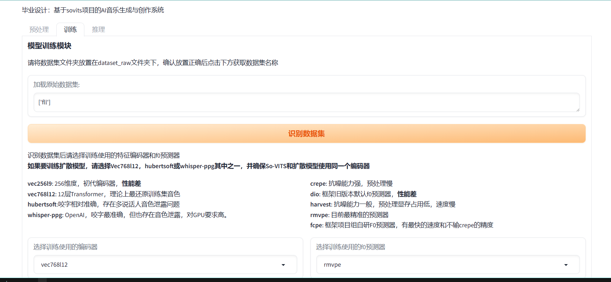

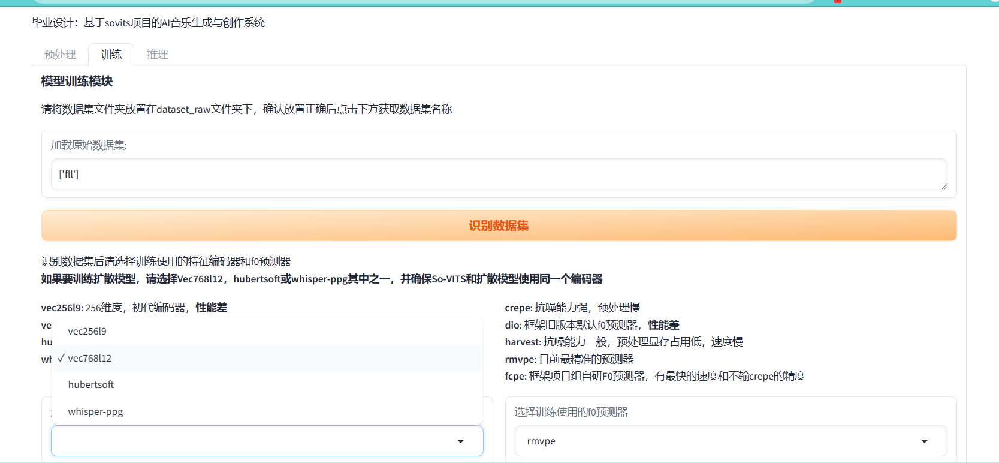


加了个这玩意


```python
             gr.Markdown(value="""请将数据集文件夹放置在dataset_raw文件夹下，确认放置正确后点击下方获取数据集名称""")
             open_raw=gr.Button("打开dataset_raw文件夹",variant="secondary")
             raw_dirs_list=gr.Textbox(label="加载原始数据集:")
             get_raw_dirs=gr.Button("识别数据集", variant="primary")
```

代码改动如下

```python
##打开文件夹[4]
def open_dataset_raw():
    folder_path = os.path.join(os.getcwd(), 'dataset_raw')
    os.system(f'explorer {folder_path}') 


##绑定事件 在加载数据集一起
        open_raw.click(open_dataset_raw,[],[])
```


#### 数据集预处理

至此，使用的库更新为

```python
import os
import gradio as gr
import re
import shutil
import subprocess
import json
```


```python
def dataset_preprocess(encoder, f0_predictor, use_diff, vol_aug, skip_loudnorm, num_processes,tiny_enable):
    if precheck_ok:
        diff_arg = "--use_diff" if use_diff else ""
        vol_aug_arg = "--vol_aug" if vol_aug else ""
        skip_loudnorm_arg = "--skip_loudnorm" if skip_loudnorm else ""
        tiny_arg = "--tiny" if tiny_enable else ""
        preprocess_commands = [
            r".\env\python.exe resample.py %s" % (skip_loudnorm_arg),
            r".\env\python.exe preprocess_flist_config.py --speech_encoder %s %s %s" % (encoder, vol_aug_arg, tiny_arg),
            r".\env\python.exe preprocess_hubert_f0.py --num_processes %s --f0_predictor %s %s" % (num_processes ,f0_predictor, diff_arg)
        ]
        accumulated_output = ""##初始化输出参数
        ##清空数据集
        dataset = os.listdir(dataset_dir)##获取文件列表
        if len(dataset) != 0:
            for dir in dataset:
                dataset_spk_dir = os.path.join(dataset_dir,str(dir))
                if os.path.isdir(dataset_spk_dir):
                    shutil.rmtree(dataset_spk_dir)
                    accumulated_output += f"已删除旧数据集文件: {dir}\n"
        for command in preprocess_commands:
            try:
                result = subprocess.Popen(command, stdout=subprocess.PIPE, stderr=subprocess.STDOUT, shell=True, text=True)
                accumulated_output += f"Command(当前命令): {command}, Using Encoder(特征编码器): {encoder}, Using f0 Predictor(f0预测器): {f0_predictor}\n"
                yield accumulated_output, None
                progress_line = None
                for line in result.stdout:
                    if r"it/s" in line or r"s/it" in line: #防止进度条刷屏
                        progress_line = line
                    else:
                        accumulated_output += line
                    if progress_line is None:
                        yield accumulated_output, None
                    else:
                        yield accumulated_output + progress_line, None
                result.communicate()
            except subprocess.CalledProcessError as e:
                result = e.output
                accumulated_output += f"Error: {result}\n"
                yield accumulated_output, None
            if progress_line is not None:
                accumulated_output += progress_line
            accumulated_output += '-' * 50 + '\n'
            yield accumulated_output, None
            config_path = "configs/config.json"
        with open(config_path, 'r') as f:
            config = json.load(f)
        spk_name = config.get('spk', None)
        yield accumulated_output, gr.Textbox.update(value=spk_name)
    else:
        yield "未识别到数据集，请检查错误信息", None

```

#### 至此前端排版如下

增加了一些彩色字体

```python
             with gr.Row():
                branch_selection = gr.Dropdown(label="选择训练使用的编码器", choices=encoder_list, value="vec768l12", interactive=True)
                f0_predictor_selection = gr.Dropdown(label="选择训练使用的f0预测器", choices=f0_options, value="rmvpe", interactive=True) 
             with gr.Row():
                use_diff = gr.Checkbox(label="预训练浅扩散模型：生成浅扩散特征，默认开启，若不训练可关闭节省硬盘空间", value=True) 
             with gr.Row():
                skip_loudnorm = gr.Checkbox(label="跳过响度匹配，默认关，若已对数据集进行过音量处理则勾选",value=False)
                num_processes = gr.Slider(label="cpu多线程加速,默认1，显存每6-8G可以选择+1提升预处理速度", minimum=1, maximum=16, value=1, step=1)  
             with gr.Row():
                gr.Markdown(value="""<span style="color:red;">右侧选项仅为vec768l12提供支持。</span>  
                响度嵌入/音量增强：自动处理响度，默认关，推荐高质量数据集开启  
                TINY模型：使用小模型,牺牲模型质量换取性能，默认关。**需要打开响度嵌入**
                      """)
                vol_aug = gr.Checkbox(label="响度嵌入/音量增强", value=False)
                tiny_enable = gr.Checkbox(label="TINY模型 ", value=False)
             with gr.Row():
                gr.Markdown(value="""<span style="color:red; display: block; text-align: center;">数据预处理会删除已处理好的数据集，如仅缺失配置文件，可选重新加载配置文件</span>  """)
             with gr.Row():
                raw_preprocess=gr.Button("数据预处理", variant="primary")
                regenerate_config_btn=gr.Button("重新生成配置文件", variant="primary")
             with gr.Row():
                preprocess_output=gr.Textbox(label="预处理输出信息，完成后请检查一下是否有报错信息，如无则可以进行下一步", max_lines=999)
             with gr.Row():
                    gr.Markdown("预处理与特征处理完成，请检查右侧说话人列表，确认无误后点击写入配置文件")
                    speakers=gr.Textbox(label="说话人列表")
```

由于使用了一个cmd命令行执行的函数，点击事件的绑定以及webui显示修改如下，其中，显示代码需要添加队列方法与对应参数

```
get_raw_dirs.click(load_raw_dirs,[],[raw_dirs_list])##[1]
raw_preprocess.click(dataset_preprocess,[branch_selection,f0_predictor_selection, use_diff, vol_aug, skip_loudnorm, num_processes,tiny_enable],[preprocess_output,speakers])
open_raw.click(open_dataset_raw,[],[])##[4]      index.queue(concurrency_count=1024,max_size=2048).launch(server_name="127.0.0.1",inbrowser=True,quiet=True)

```

此时界面应该如图所示并且能够唤醒cmd界面进行训练


增加清空输出模块

```python
##清理CMD输出
def clear_output():
    return gr.Textbox.update(label="清理完毕",value="")

```


```python
        clear_preprocess_output.click(clear_output,[],[preprocess_output])##[5]
```

此时整个项目前端模板为

```python
        with gr.TabItem("训练") as train_tab:   
             gr.Markdown(value="""
                        ### 模型训练模块
                         
                        """)
             gr.Markdown(value="""请将数据集文件夹放置在dataset_raw文件夹下，确认放置正确后点击下方获取数据集名称""")
             open_raw=gr.Button("打开dataset_raw文件夹",variant="secondary")
             raw_dirs_list=gr.Textbox(label="加载原始数据集:")
             get_raw_dirs=gr.Button("识别数据集", variant="primary")
             gr.Markdown(value="""识别数据集后请选择训练使用的特征编码器和f0预测器  
                         **如果要训练扩散模型，请选择Vec768l12，hubertsoft或whisper-ppg其中之一，并确保So-VITS和扩散模型使用同一个编码器**""")
             with gr.Row():
                gr.Markdown(value="""**vec256l9**: 256维度，初代编码器，**性能差**  
                            **vec768l12**: 12层Transformer，理论上最还原训练集音色  
                            **hubertsoft**:咬字相对准确，存在多说话人音色泄露问题  
                            **whisper-ppg**: OpenAI，咬字最准确，但也存在音色泄露，对GPU要求高。
                                
                """)
                gr.Markdown(value="""**crepe**: 抗噪能力强，预处理慢   
                            **dio**: 框架旧版本默认f0预测器，**性能差**  
                            **harvest**: 抗噪能力一般，预处理显存占用低，速度慢  
                            **rmvpe**: 目前最精准的预测器  
                            **fcpe**: 框架项目组自研F0预测器，有最快的速度和不输crepe的精度
                """)
             with gr.Row():
                branch_selection = gr.Dropdown(label="选择训练使用的编码器", choices=encoder_list, value="vec768l12", interactive=True)
                f0_predictor_selection = gr.Dropdown(label="选择训练使用的f0预测器", choices=f0_options, value="rmvpe", interactive=True) 
             with gr.Row():
                use_diff = gr.Checkbox(label="预训练浅扩散模型：生成浅扩散特征，默认开启，若不训练可关闭节省硬盘空间", value=True) 
             with gr.Row():
                skip_loudnorm = gr.Checkbox(label="跳过响度匹配，默认关，若已对数据集进行过音量处理则勾选",value=False)
                num_processes = gr.Slider(label="cpu多线程加速,默认1，显存每6-8G可以选择+1提升预处理速度", minimum=1, maximum=16, value=1, step=1)  
             with gr.Row():
                gr.Markdown(value="""<span style="color:red;">右侧选项仅为vec768l12提供支持。</span>  
                响度嵌入/音量增强：自动处理响度，默认关，推荐高质量数据集开启  
                TINY模型：使用小模型,牺牲模型质量换取性能，默认关。**需要打开响度嵌入**
                      """)
                vol_aug = gr.Checkbox(label="响度嵌入/音量增强", value=False)
                tiny_enable = gr.Checkbox(label="TINY模型 ", value=False)
             with gr.Row():
                gr.Markdown(value="""<span style="color:red; display: block; text-align: center;">数据预处理会删除已处理好的数据集，如仅缺失配置文件，可选重新加载配置文件</span>  """)
             with gr.Row():
                raw_preprocess=gr.Button("数据预处理", variant="primary")
                regenerate_config_btn=gr.Button("重新生成配置文件", variant="primary")
             with gr.Row():
                preprocess_output=gr.Textbox(label="预处理输出信息，完成后请检查一下是否有报错信息，如无则可以进行下一步", max_lines=999)
             with gr.Row():
                clear_preprocess_output=gr.Button("清空CMD通知")
             with gr.Row():
                    gr.Markdown("预处理与特征处理完成，请检查右侧说话人列表，确认无误后进行下一步配置文件与训练")
                    speakers=gr.Textbox(label="说话人列表")
```

重新生成配置文件

```
##重新生成[5]
def regenerate_config(encoder, vol_aug, tiny_enable):
    if precheck_ok is False:
        return "数据集识别失败，请检查报错信息"
    vol_aug_arg = "--vol_aug" if vol_aug else ""
    tiny_arg = "--tiny" if tiny_enable else ""
    cmd = r".\env\python.exe preprocess_flist_config.py --speech_encoder %s %s %s" % (encoder, vol_aug_arg, tiny_arg)
    output = ""
    try:
        result = subprocess.Popen(cmd, stdout=subprocess.PIPE, stderr=subprocess.STDOUT, shell=True, text=True)
        for line in result.stdout:
            output += line
        output += "Regenerate config file successfully."
    except subprocess.CalledProcessError as e:
        result = e.output
        output += f"Error: {result}\n"
    return output

```


#### 训练模块

库需求更新

```python
import os
import gradio as gr
import re
import shutil
import subprocess
import json
import torch
```

获取本机GPU信息，有其他GPU的可自行修改GPU名称判断

```python
import torch
ngpu=torch.cuda.device_count()
gpu_infos = []##初始化gpu信息
if(torch.cuda.is_available() is False or ngpu==0):
    check_gpu = False
else:
    check_gpu = False
    for i in range(ngpu):
        gpu_name = torch.cuda.get_device_name(i)
        if("MX" in gpu_name):
            continue
        if("RTX" in gpu_name.upper() or "GTX" in gpu_name.upper() or "A" in gpu_name.upper() or "V" in gpu_name.upper() or "T" in gpu_name.upper() or "P" in gpu_name.upper() or "M4" in gpu_name.upper()):
            check_gpu = True
            gpu_infos.append("序号：%s\tGPU型号:%s"%(i,gpu_name))
gpu_info="\n".join(gpu_infos)if check_gpu is True and len(gpu_infos)>0 else "GPU不可用或不支持，请检查"##转换为单列文本，便于后期使用
gpus="-".join([i[3]for i in gpu_infos])##获取GPU序号信息
##print(gpus,gpu_info)
```

去除注释后输出：

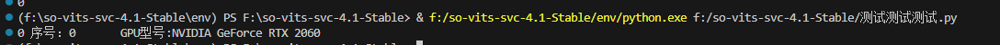

```python
# 读取用于推断的 CUDA 信息
cuda = {}  # 用于存储 CUDA 相关信息的字典
min_vram = 0  # VRAM 的最小值初始化为 0

if torch.cuda.is_available():
    # 如果有可用的 CUDA 设备
    for i in range(torch.cuda.device_count()):
        # 遍历每个 CUDA 设备
        current_vram = torch.cuda.get_device_properties(i).total_memory  # 获取当前设备的总显存
        min_vram = current_vram if current_vram > min_vram else min_vram  # 更新最小显存值
        device_name = torch.cuda.get_device_properties(i).name  # 获取设备名称
        cuda[f"CUDA:{i} {device_name}"] = f"cuda:{i}"  # 将设备信息添加到 cuda 字典中

# 计算总显存并推荐批次大小
total_vram = round(min_vram * 9.31322575e-10) if min_vram != 0 else 0  # 计算总显存，并将其转换为 GB
auto_batch = total_vram -4 if total_vram <= 12 and total_vram > 0 else total_vram  # 推荐的批次大小
print(f"当前显存：{total_vram} GiB，推荐批次大小：{auto_batch}")


```

当前输出

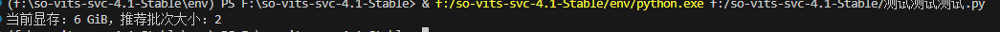

检查BF16（30系及以上可用，动态浮点计算加速）

```python
##检查bf16是否可用
amp_options = ["fp32", "fp16"]
if check_gpu:
    if torch.cuda.is_bf16_supported():
        amp_options = ["fp32", "fp16", "bf16"] 

```


检查编码器信息

```python
##查找本地编码器
vocoder_options = []
for dir in os.listdir("pretrain"):
    if os.path.isdir(os.path.join("pretrain", dir)):
        if os.path.isfile(os.path.join("pretrain", dir, "model")) and os.path.isfile(os.path.join("pretrain", dir, "config.json")):
            vocoder_options.append(dir)
```


配置文件保存模块开发

```python
import os
import gradio as gr
import re
import shutil
import subprocess
import json
import torch
import yaml

sovits_params = {}
diff_params = {}
precheck_ok = False
raw_path = "dataset_raw"
dataset_dir = "dataset/44k"
default_settings_file = "defset.yaml"
class Cfg:
    def __init__(self, path, type):
        """
        初始化配置对象。

        Args:
            path (str): 配置文件的路径。
            type (str): 配置文件的类型 ("json" 或 "yaml")。
        """
        self.path = path
        self.type = type
    
    def read(self):
        """
        从文件中读取配置数据。

        Returns:
            dict: 将配置文件的内容作为字典返回。
        """
        if self.type == "json":
            with open(self.path, 'r') as f:
                return json.load(f)
        if self.type == "yaml":
            with open(self.path, 'r') as f:
                return yaml.safe_load(f)
    
    def save(self, content):
        """
        将提供的内容保存到配置文件中。

        Args:
            content (dict): 要保存到文件中的内容。
        """
        if self.type == "json":
            with open(self.path, 'w') as f:
                json.dump(content, f, indent=4)
        if self.type == "yaml":
            with open(self.path, 'w') as f:
                yaml.safe_dump(content, f, default_flow_style=False, sort_keys=False)

def save_default_settings(log_interval,eval_interval,keep_ckpts,batch_size,learning_rate,amp_dtype,all_in_mem,num_workers,cache_all_data,cache_device,diff_amp_dtype,diff_batch_size,diff_lr,diff_interval_log,diff_interval_val,diff_force_save,diff_k_step_max):
    config_file = Cfg(default_settings_file, "yaml")
    default_settings = config_file.read()
    default_settings['sovits_params']['log_interval'] = int(log_interval)
    default_settings['sovits_params']['eval_interval'] = int(eval_interval)
    default_settings['sovits_params']['keep_ckpts'] = int(keep_ckpts)
    default_settings['sovits_params']['batch_size'] = int(batch_size)
    default_settings['sovits_params']['learning_rate'] = float(learning_rate)
    default_settings['sovits_params']['amp_dtype'] = str(amp_dtype)
    default_settings['sovits_params']['all_in_mem'] = all_in_mem
    default_settings['diff_params']['num_workers'] = int(num_workers)
    default_settings['diff_params']['cache_all_data'] = cache_all_data
    default_settings['diff_params']['cache_device'] = str(cache_device)
    default_settings['diff_params']['amp_dtype'] = str(diff_amp_dtype)
    default_settings['diff_params']['diff_batch_size'] = int(diff_batch_size)
    default_settings['diff_params']['diff_lr'] = float(diff_lr)
    default_settings['diff_params']['diff_interval_log'] = int(diff_interval_log)
    default_settings['diff_params']['diff_interval_val'] = int(diff_interval_val)
    default_settings['diff_params']['diff_force_save'] = int(diff_force_save)
    default_settings['diff_params']['diff_k_step_max'] = diff_k_step_max
    config_file.save(default_settings)
    return "成功保存默认配置"

def get_default_settings():
    global sovits_params, diff_params
    config_file = Cfg(default_settings_file, "yaml")
    default_settings = config_file.read()
    sovits_params = default_settings['sovits_params']
    diff_params = default_settings['diff_params']
    return sovits_params, diff_params
print(get_default_settings())
```

在根目录新建应该defset.yaml，粘贴以下内容

```yaml
sovits_params:
  log_interval: 200
  eval_interval: 800
  keep_ckpts: 3
  batch_size: 2
  learning_rate: 0.0001
  amp_dtype: fp32
  all_in_mem: true
diff_params:
  num_workers: 2
  cache_all_data: true
  cache_device: cuda
  amp_dtype: fp32
  diff_batch_size: 24
  diff_lr: 0.0002
  diff_interval_log: 10
  diff_interval_val: 2000
  diff_force_save: 10000
  diff_k_step_max: false

```

输出为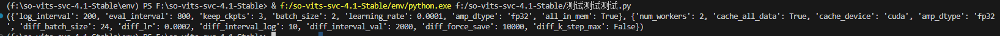


此时，包和参数如下

```
import os
import gradio as gr
import re
import shutil
import subprocess
import json
import torch
import yaml


##一些参数
default_settings_file = "defset.yaml"
workdir = "logs/44k"
diff_workdir = "logs/44k/diffusion"
config_dir = "configs/"
sovits_params = {}
diff_params = {}
precheck_ok = False
raw_path = "dataset_raw"
dataset_dir = "dataset/44k"
f0_options = ["crepe","pm","dio","harvest","rmvpe","fcpe"]
ENCODER_PRETRAIN = {
    "vec256l9": "pretrain/checkpoint_best_legacy_500.pt",
    "vec768l12": "pretrain/checkpoint_best_legacy_500.pt",
    "hubertsoft": "pretrain/hubert-soft-0d54a1f4.pt",
    "whisper-ppg": "pretrain/medium.pt",
    "cnhubertlarge": "pretrain/chinese-hubert-large-fairseq-ckpt.pt",
    "dphubert": "pretrain/DPHuBERT-sp0.75.pth",
    "wavlmbase+": "pretrain/WavLM-Base+.pt",
    "whisper-ppg-large": "pretrain/large-v2.pt"
}
```

配置文件相关代码注释掉print之后放入函数部分

```python
##函数后添加
sovits_params, diff_params = get_default_settings()##调用信息
ckpt_read_dir = workdir
config_read_dir = config_dir
diff_read_dir = diff_workdir
```

至此，完成到了模型默认配置的准备

前端代码如下‘

```python
index = gr.Blocks()
with index:
    gr.Markdown(value='''### 本系统基于sovits框架4.1版本
                毕业设计：基于sovits项目的AI音乐生成与创作系统
                ''')
    with gr.Tabs():
        with gr.TabItem('音频切片预处理工具') as preprocessing_tab:
             gr.Markdown(value="""
                        ### 预处理模块
                    
                        """)
        with gr.TabItem("训练") as train_tab:   
             gr.Markdown(value="""
                        ### 模型训练模块
                         
                        """)
             gr.Markdown(value="""请将数据集文件夹放置在dataset_raw文件夹下，确认放置正确后点击下方获取数据集名称""")
             open_raw=gr.Button("打开dataset_raw文件夹",variant="secondary")
             raw_dirs_list=gr.Textbox(label="加载原始数据集:")
             get_raw_dirs=gr.Button("识别数据集", variant="primary")
             gr.Markdown(value="""识别数据集后请选择训练使用的特征编码器和f0预测器  
                         **如果要训练扩散模型，请选择Vec768l12，hubertsoft或whisper-ppg其中之一，并确保So-VITS和扩散模型使用同一个编码器**""")
             with gr.Row():
                gr.Markdown(value="""**vec256l9**: 256维度，初代编码器，**性能差**  
                            **vec768l12**: 12层Transformer，理论上最还原训练集音色  
                            **hubertsoft**:咬字相对准确，存在多说话人音色泄露问题  
                            **whisper-ppg**: OpenAI，咬字最准确，但也存在音色泄露，对GPU要求高。
                                
                """)
                gr.Markdown(value="""**crepe**: 抗噪能力强，预处理慢   
                            **dio**: 框架旧版本默认f0预测器，**性能差**  
                            **harvest**: 抗噪能力一般，预处理显存占用低，速度慢  
                            **rmvpe**: 目前最精准的预测器  
                            **fcpe**: 框架项目组自研F0预测器，有最快的速度和不输crepe的精度
                """)
             with gr.Row():
                branch_selection = gr.Dropdown(label="选择训练使用的编码器", choices=encoder_list, value="vec768l12", interactive=True)
                f0_predictor_selection = gr.Dropdown(label="选择训练使用的f0预测器", choices=f0_options, value="rmvpe", interactive=True) 
             with gr.Row():
                use_diff = gr.Checkbox(label="预训练浅扩散模型：生成浅扩散特征，默认开启，若不训练可关闭节省硬盘空间", value=True) 
             with gr.Row():
                skip_loudnorm = gr.Checkbox(label="跳过响度匹配，默认关，若已对数据集进行过音量处理则勾选",value=False)
                num_processes = gr.Slider(label="cpu多线程加速,默认1，显存每6-8G可以选择+1提升预处理速度", minimum=1, maximum=16, value=1, step=1)  
             with gr.Row():
                gr.Markdown(value="""<span style="color:red;">右侧选项仅为vec768l12提供支持。</span>  
                响度嵌入/音量增强：自动处理响度，默认关，推荐高质量数据集开启  
                TINY模型：使用小模型,牺牲模型质量换取性能，默认关。**需要打开响度嵌入**
                      """)
                vol_aug = gr.Checkbox(label="响度嵌入/音量增强", value=False)
                tiny_enable = gr.Checkbox(label="TINY模型 ", value=False)
             with gr.Row():
                gr.Markdown(value="""<span style="color:red; display: block; text-align: center;">数据预处理会删除已处理好的数据集，如仅缺失配置文件，可选重新加载配置文件<span style="color:red;">  """)
             with gr.Row():
                raw_preprocess=gr.Button("数据预处理", variant="primary")
                regenerate_config_btn=gr.Button("重新生成配置文件", variant="primary")
             with gr.Row():
                preprocess_output=gr.Textbox(label="预处理输出信息，完成后请检查一下是否有报错信息，如无则可以进行下一步", max_lines=999)
             with gr.Row():
                clear_preprocess_output=gr.Button("清空CMD通知")
             with gr.Row():
                    gr.Markdown("预处理与特征处理完成后，请检查右侧说话人列表，确认无误后进行下一步准备配置文件")
                    speakers=gr.Textbox(label="说话人列表")
             with gr.Accordion(label="主模型超参数列表 点击打开 否则按照默认参数训练",open=False):
                with gr.Row():
                    gr.Textbox(label="显卡信息", value=gpu_info)
                with gr.Row():
                    chose_gpu = gr.Textbox(label="显卡选择，默认0号，多卡用户西文逗号分隔，如0,1,2...",value=gpus,interactive=True)
                with gr.Row():
                    log_interval = gr.Textbox(label="日志间隔 即多久输出一次损失日志",value=sovits_params['log_interval'],interactive=True)
                    eval_interval = gr.Textbox(label="评估间隔 即多久保存一次模型",value=sovits_params['eval_interval'],interactive=True)
                    keep_ckpts = gr.Textbox(label="保存模型数量 即仅保留最新的N个模型 旧模型会删除，若需要保存过程中的每个模型则设置为0 ",value=3,interactive=True)
                with gr.Row():
                    batch_size=gr.Textbox(label="batch_size，6G建议1-2，每多2G可尝试+1", value=auto_batch)
                    lr = gr.Textbox(label="学习率 默认0.0001 若数据集过大或过小可微调，微调范围+-0.0001内",value=sovits_params['learning_rate'],interactive=True)
                    amp_dtype = gr.Radio(label="浮点类型，默认f32即可，显卡型号较新也可尝试f16", choices=amp_options, value=sovits_params['amp_dtype'])
                    all_in_mem=gr.Checkbox(label="内存加速，建议打开，数据集将全部加载到内存，避免硬盘io低下影响训练", value=sovits_params['all_in_mem'])
             with gr.Accordion(label = "扩散模型配置文件 点击打开 否则同样默认参数", open=False):
                with gr.Row():
                    diff_num_workers = gr.Number(label="num_workers, 设置为0将作为主进程与cpu交互，但是容易出现死锁，仅建议高性能用户改动", value=diff_params['num_workers'])
                    diff_k_step_max = gr.Checkbox(label="100步深度的浅扩散。加快训练速度并提高模型质量，但无法执行超过100步的浅扩散推理", value=diff_params['diff_k_step_max'])
                    diff_cache_all_data = gr.Checkbox(label="数据缓存，启用后加快训练速度，关闭后节省显存或内存，减慢训练速度", value=diff_params['cache_all_data'])
                    diff_cache_device = gr.Radio(label="缓存硬件：需开启数据缓存，建议使用cuda/gpu显存加速", choices=["cuda","cpu"], value=diff_params['cache_device'])
                    diff_amp_dtype = gr.Radio(label="浮点类型，默认f32，较新的显卡可选f16提速", choices=["fp32","fp16"], value=diff_params['amp_dtype'])
                with gr.Row():
                    diff_batch_size = gr.Number(label="batch_size，数值尽量不超过数据集1/4，6G建议24左右，显存越大可适当增大", value=diff_params['diff_batch_size'])
                    diff_lr = gr.Number(label="学习率 建议仅+-0.0001范围内微调", value=diff_params['diff_lr'])
                    diff_interval_log = gr.Number(label="日志间隔", value = diff_params['diff_interval_log'])
                    diff_interval_val = gr.Number(label="验证间隔  不建议过低 建议1000+", value=diff_params['diff_interval_val'])
                    diff_force_save = gr.Number(label="强制保留模型，该步数倍数保存的模型会被保留，其余会被删除。设置为与验证步数相同的值则每个模型都会被保留", value=diff_params['diff_force_save'])
             with gr.Row():
                save_params=gr.Button("保存为默认设置", variant="primary")
                write_config=gr.Button("写入配置文件", variant="primary")
             write_config_output=gr.Textbox(label="输出信息")

        with gr.TabItem('推理') as inference_tab:
              gr.Markdown(value="""
                        ### 音频推理模块
                         
                        """)
        get_raw_dirs.click(load_raw_dirs,[],[raw_dirs_list])##[1]
        raw_preprocess.click(dataset_preprocess,[branch_selection,f0_predictor_selection, use_diff, vol_aug, skip_loudnorm, num_processes,tiny_enable],[preprocess_output,speakers])
        open_raw.click(open_dataset_raw,[],[])##[4]
        clear_preprocess_output.click(clear_output,[],[preprocess_output])##[4.1]
        regenerate_config_btn.click(regenerate_config,[branch_selection, vol_aug, tiny_enable],[preprocess_output])
        save_params.click(save_default_settings, [log_interval,eval_interval,keep_ckpts,batch_size,lr,amp_dtype,all_in_mem,diff_num_workers,diff_cache_all_data,diff_cache_device,diff_amp_dtype,diff_batch_size,diff_lr,diff_interval_log,diff_interval_val,diff_force_save,diff_k_step_max], [write_config_output])
        
```


接下来添加配置写入函数

```python
def config_fn(log_interval, eval_interval, keep_ckpts, batch_size, lr, amp_dtype, all_in_mem, diff_num_workers, diff_cache_all_data, diff_batch_size, diff_lr, diff_interval_log, diff_interval_val, diff_cache_device, diff_amp_dtype, diff_force_save, diff_k_step_max):
    if amp_dtype == "fp16" or amp_dtype == "bf16":
        fp16_run = True
    else:
        fp16_run = False
        amp_dtype = "fp16"
    config_origin = Cfg("configs/config.json", "json")
    diff_config = Cfg("configs/diffusion.yaml", "yaml")
    config_data = config_origin.read()
    config_data['train']['log_interval'] = int(log_interval)
    config_data['train']['eval_interval'] = int(eval_interval)
    config_data['train']['keep_ckpts'] = int(keep_ckpts)
    config_data['train']['batch_size'] = int(batch_size)
    config_data['train']['learning_rate'] = float(lr)
    config_data['train']['fp16_run'] = fp16_run
    config_data['train']['half_type'] = str(amp_dtype)
    config_data['train']['all_in_mem'] = all_in_mem
    config_origin.save(config_data)
    diff_config_data = diff_config.read()
    diff_config_data['train']['num_workers'] = int(diff_num_workers)
    diff_config_data['train']['cache_all_data'] = diff_cache_all_data
    diff_config_data['train']['batch_size'] = int(diff_batch_size)
    diff_config_data['train']['lr'] = float(diff_lr)
    diff_config_data['train']['interval_log'] = int(diff_interval_log)
    diff_config_data['train']['interval_val'] = int(diff_interval_val)
    diff_config_data['train']['cache_device'] = str(diff_cache_device)
    diff_config_data['train']['amp_dtype'] = str(diff_amp_dtype)
    diff_config_data['train']['interval_force_save'] = int(diff_force_save)
    diff_config_data['model']['k_step_max'] = 100 if diff_k_step_max else 0
    diff_config.save(diff_config_data)
    return "配置文件写入完成"
```

在按键绑定中添加

```python
write_config.click(config_fn,[log_interval, eval_interval, keep_ckpts, batch_size, lr, amp_dtype, all_in_mem, diff_num_workers, diff_cache_all_data, diff_batch_size, diff_lr, diff_interval_log, diff_interval_val, diff_cache_device, diff_amp_dtype, diff_force_save, diff_k_step_max],[write_config_output])
        
```


#### 启动训练相关

首先是检查数据集是否可用：

由于已知数据集处理后包含npy和pt的编码与f0权重，设置一个函数来检查数据集。

```python
def check_dataset(dataset_path):
    if not os.listdir(dataset_path):
        return "该路径下未检测到数据集"##检测数据集目录是否存在
    unavailable_dataset = True
    for root, dirs, files in os.walk(dataset_path):
        for file in files:
            if file.endswith('.pt') or file.endswith('.npy'):
                ##return "已检查到到数据集"
                unavailable_dataset = False
                break
    if unavailable_dataset:
        return "该目录下未存在一个有效的数据集权重，请检查文件目录是否有pt或者npy的模型文件"
    return None

```

接下来是启动训练的函数：分为从0开始和继续训练，由于模型的特殊性，从0 开始需要准备对应的预训练模型（称之为底模），方便模型进行特征学习，不然自己训练底模只能达到五分之一左右的效果。

底模从社区获取，模型路径如下图

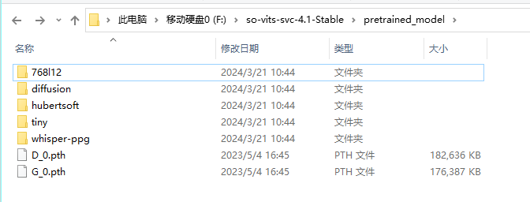

添加备份文件夹 新建

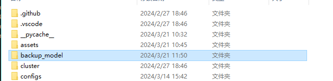

```python
backup_path = 'backup_model'
```

路径如上
训练函数：

```python

def training(gpu_selection,encoder,tiny_enable):
    if tiny_enable:
        encoder = ""
    config_data_cfg = Cfg("configs/config.json", "json")
    config_data = config_data_cfg.read()##调用配置文件信息
    vol_emb = config_data["model"]["vol_embedding"]
    warn = check_dataset(dataset_dir)
    if warn is not None:
        return warn
    pretain_path = {
                "vec256l9": ("D_0.pth", "G_0.pth", "pretrained_model"),
        "vec768l12": ("D_0.pth", "G_0.pth", "pretrained_model/768l12/vol_emb" if vol_emb else "pretrained_model/768l12"),
        "vec768l12_tiny": ("D_0.pth", "G_0.pth", "pretrained_model/tiny/vec768l12_vol_emb"),
        "hubertsoft": ("D_0.pth", "G_0.pth", "pretrained_model/hubertsoft"),
        "whisper-ppg": ("D_0.pth", "G_0.pth", "pretrained_model/whisper-ppg"),
        "cnhubertlarge": ("D_0.pth", "G_0.pth", "pretrained_model/cnhubertlarge"),
        "dphubert": ("D_0.pth", "G_0.pth", "pretrained_model/dphubert"),
        "wavlmbase+": ("D_0.pth", "G_0.pth", "pretrained_model/wavlmbase+"),
        "whisper-ppg-large": ("D_0.pth", "G_0.pth", "pretrained_model/whisper-ppg-large")
    }
    if not encoder in pretain_path:
        return "未找到对应编码器底模，请检查编码器是否存在"
    D_file,G_file,encoder_path = pretain_path[encoder]
    D_path = os.path.join(encoder_path,D_file)
    G_path = os.path.join(encoder_path,G_file)
    time_stamp = datetime.datetime.now().strftime('%Y_%m_%d_%H_%M')
    backup_folder = os.path.join(backup_path,time_stamp)
    output_msg = "备份已完成，旧模型被保存在%s" %(backup_folder)
    if os.listdir(workdir) != ['diffusion']:
        os.makedirs(new_backup_folder, exist_ok=True)
        for file in os.listdir(workdir):
            if file != "diffusion":
                shutil.move(os.path.join(workdir, file), os.path.join(new_backup_folder, file))
    if os.path.isfile(G_path) and os.path.isfile(D_path):
        shutil.copy(D_path, os.path.join(workdir, "D_0.pth"))
        shutil.copy(G_path, os.path.join(workdir, "G_0.pth"))
        output_msg += f"成功装载预训练模型，编码器：{encoder}\n"
    else:
        output_msg += f"{encoder}的预训练模型不存在，未装载预训练模型\n"

    cmd = r"set CUDA_VISIBLE_DEVICES=%s && .\env\python.exe train.py -c configs/config.json -m 44k" % (gpu_selection)
    subprocess.Popen(["cmd", "/c", "start", "cmd", "/k", cmd])
    output_msg += "训练已开始，如果需要中断训练，请在CMD内按下ctrl+C"
    return output_msg
```

继续训练函数（多段输出使用output_msg进行自增，单端输出直接return）

```python
def continue_training(gpu_selection,encoder):
    warn = check_dataset(dataset_dir)
    if warn is not None:
        return warn
    file = os.listdir(workdir)
    # 从工作目录下的所有文件中筛选文件名以'G_'开头且以'.pth'结尾的文件
    files = [f for f in file if f.startswith('G_') and f.endswith('.pth')]
    if len(files) == 0:
        return "未找到已训练模型，无法继续训练，请检查文件目录或者使用重新开始训练。"
    cmd = r"set CUDA_VISIBLE_DEVICES=%s && .\env\python.exe train.py -c configs/config.json -m 44k" % (gpu_selection)
    subprocess.Popen(["cmd","/c","start","cmd","/k",cmd])
    return "训练已开始，如果需要中断训练，请在CMD内按下ctrl+C"

    
```

要导入：

```python
import datetime

```

此时前端代码添加：

```PYTHON
             with gr.Row():
                save_params=gr.Button("保存为默认设置", variant="primary")
                write_config=gr.Button("写入配置文件", variant="primary")
             write_config_output=gr.Textbox(label="输出信息")
             with gr.Row():
                with gr.Column():
                    start_train = gr.Button("开始训练",variant='primary')
                    train_out = gr.Textbox(label="训练信息")
                with gr.Column():
                    continue_train = gr.Button("继续训练",variant="primary")
                    continue_train_out = gr.Textbox(label="训练信息")
```

按键绑定

```python
        start_train.click(training,[chose_gpu, branch_selection, tiny_enable],[train_out])
        continue_train.click(continue_training,[chose_gpu, branch_selection],[continue_train_out])
```

缝缝补补，改完之后应该可以实现如下效果：

点击开始训练，弹出cmd并且提示loaded checkpoints G0（说明正确加载了预训练模型）

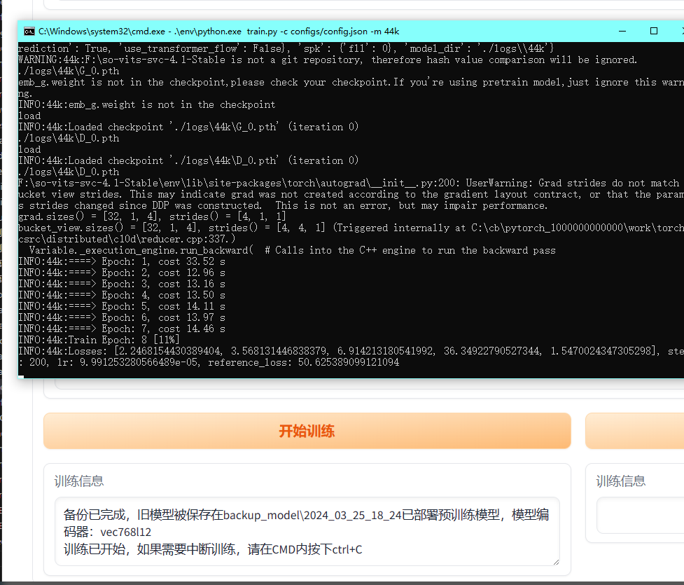

使用ctrl+c键盘中断，接下来检查继续训练

首先来到logs/44k路径下。删除除了diffusion目录的所有文件（也可以直接覆盖，复制备份文件夹内文件直接粘贴）

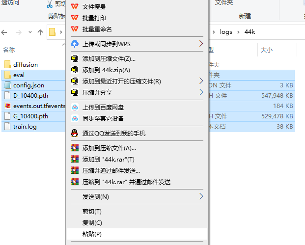

之后将之前备份的模型文件复制过来（只需要G,D各一个再加上配置文件即可，日志文件复制可选，因为可以承接之前的训练输出）
之后直接点击继续训练即可

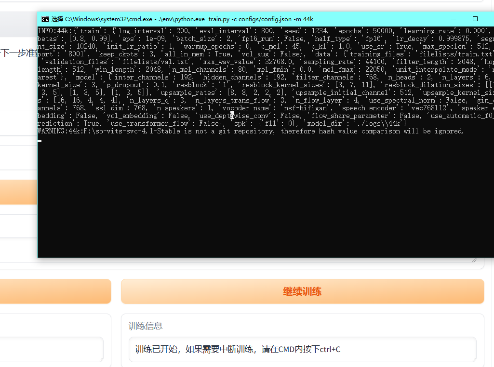


完成其他几个模型的函数：

```python
def kmeans_training(kmeans_gpu):
    if not os.listdir(dataset_dir):
        return "数据集不存在，请检查dataset文件夹"
    cmd = r".\env\python.exe cluster/train_cluster.py --gpu" if kmeans_gpu else r".\env\python.exe cluster/train_cluster.py"
    subprocess.Popen(["cmd", "/c", "start", "cmd", "/k", cmd])
    return "训练已开始，cpu需要5-10min，无终端输出"

def index_training():
    if not os.listdir(dataset_dir):
        return "数据集不存在，请检查dataset文件夹"
    cmd = r".\env\python.exe train_index.py -c configs/config.json"
    subprocess.Popen(["cmd", "/c", "start", "cmd", "/k", cmd])
    return "训练已开始"

def diff_training(encoder, k_step_max):
    if not os.listdir(dataset_dir):
        return "数据集不存在，请检查dataset文件夹"
    timestamp = datetime.datetime.now().strftime('%Y_%m_%d_%H_%M')
    new_backup_folder = os.path.join(backup_path, "diffusion", str(timestamp))
    if len(os.listdir(diff_workdir)) != 0:
        os.makedirs(new_backup_folder, exist_ok=True)
        for file in os.listdir(diff_workdir):
            shutil.move(os.path.join(diff_workdir, file), os.path.join(new_backup_folder, file))
    DIFF_PRETRAIN = {
        "768-kstepmax100": "pretrained_model/diffusion/768l12/max100/model_0.pt",
        "vec768l12": "pretrained_model/diffusion/768l12/model_0.pt",
        "hubertsoft": "pretrained_model/diffusion/hubertsoft/model_0.pt",
        "whisper-ppg": "pretrained_model/diffusion/whisper-ppg/model_0.pt"
    }
    if encoder not in DIFF_PRETRAIN:
        return "该编码器不支持训练扩散模型"
    if k_step_max:
        encoder = "768-kstepmax100"
    diff_pretrained_model = DIFF_PRETRAIN[encoder]
    shutil.copy(diff_pretrained_model, os.path.join(diff_workdir, "model_0.pt"))
    subprocess.Popen(["cmd", "/c", "start", "cmd", "/k", r".\env\python.exe train_diff.py -c configs/diffusion.yaml"])
    output_message = "训练已开始，如果需要中断训练，请在CMD内按下ctrl+C。"
    if encoder == "768-kstepmax100":
        output_message += "\n正在进行100步深度的浅扩散训练，已加载底模"
    else:
        output_message += f"\n正在进行完整深度的扩散训练，编码器{encoder}"
    return output_message

def diff_continue_training(encoder):
    if not os.listdir(dataset_dir):
        return "数据集不存在，请检查dataset文件夹"
    if encoder == "":
        return "未选择预处理对应的编码器"
    all_files = os.listdir(diff_workdir)
    model_files = [f for f in all_files if f.endswith('.pt')]
    if len(model_files) == 0:
        return "未找到已训练模型，无法继续训练，请检查文件目录或者使用重新开始训练。"
    subprocess.Popen(["cmd", "/c", "start", "cmd", "/k", r".\env\python.exe train_diff.py -c configs/diffusion.yaml"])
    return "训练已开始，如果需要中断训练，请在CMD内按下ctrl+C。"
```

```python
             with gr.Accordion(label="扩散模型",open=False):
                with gr.Row():
                    with gr.Column():
                        start_train_diff = gr.Button("开始训练",variant='primary')
                        train_diff_out = gr.Textbox(label="训练信息")
                    with gr.Column():
                        continue_train_diff = gr.Button("继续训练",variant="primary")
                        continue_train_diff_out = gr.Textbox(label="训练信息")
                        
                        

		start_train_diff.click(diff_training,[branch_selection, diff_k_step_max],[train_diff_out])
        continue_train_diff.click(diff_continue_training,[branch_selection],[continue_train_diff_out])

```

前端代码与按键绑定如上

此时，浅扩散训练按钮效果如下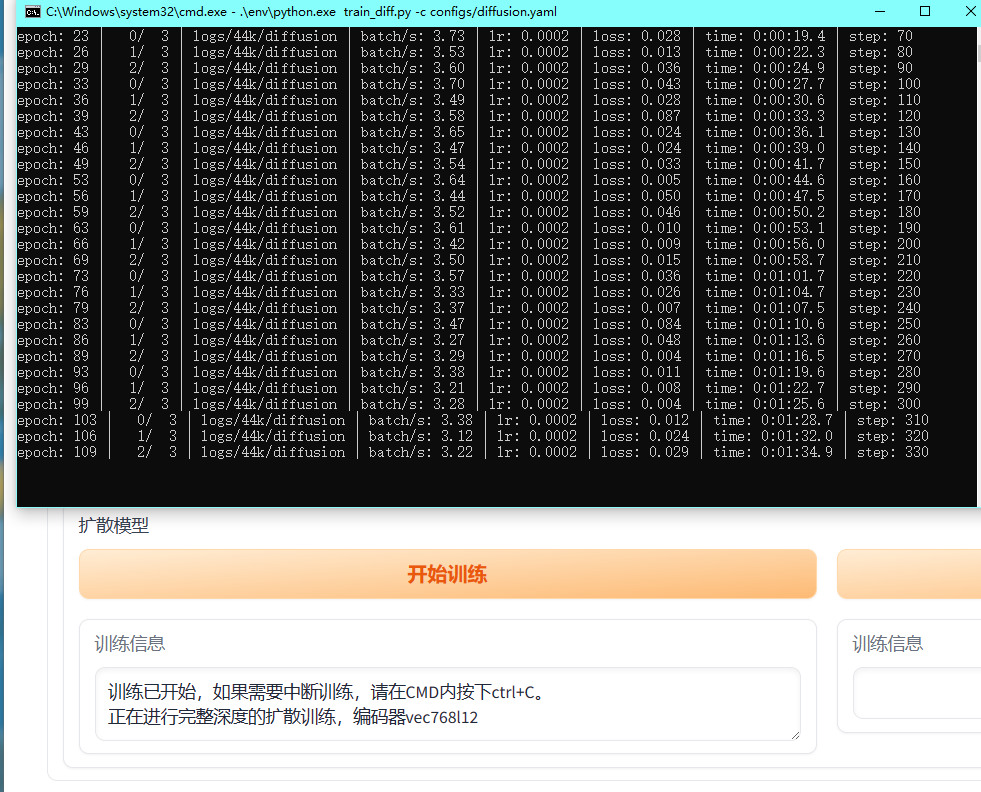


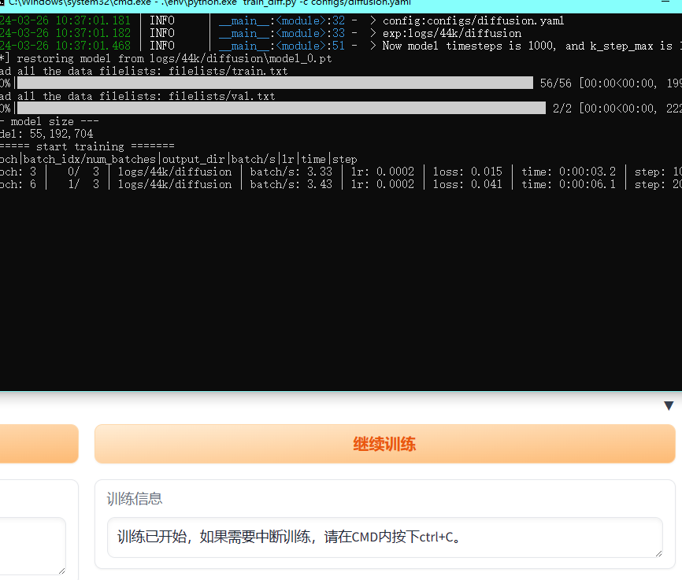


特征模型和聚类模型绑定如下

```python
        train_index.click(index_training,[],[train_index_out])
        train_kmeans.click(kmeans_training,[chose_gpu],[train_kmeans_out])
        
        
        #前端如下：
                        with gr.Row():
                    with gr.Column():
                        train_index = gr.Button("开始训练特征检索模型",variant='primary')
                        train_index_out = gr.Textbox(label="训练信息")
                    with gr.Column():                                                       
                        train_kmeans = gr.Button("开始训练kmeans聚类模型",variant="primary")
                        train_kmeans_out = gr.Textbox(label="训练信息")
```

tensorboard如下

```python
             with gr.Row():
                tensorboard_bth = gr.Button("打开tensorboard",variant="primary")
                tensorboard_out = gr.Textbox()
#按钮绑定
        tensorboard_bth.click(tensorboard_open,[],[tensorboard_out])
#函数设计
def tensorboard_open():
    subprocess.Popen(["cmd", "/c", "start", "cmd", "/k", r".\env\python.exe -m tensorboard.main --logdir=logs\44k"])
    return "已打开tensorboard，请复制ip地址浏览器使用"
```

至此，训练模块制作完成，开始制作推理模块


### 推理模块

添加定义

  ```python
model = None
debug = False

MODEL_TYPE = {
    "vec768l12": 768,
    "vec256l9": 256,
    "hubertsoft": 256,
    "whisper-ppg": 1024,
    "cnhubertlarge": 1024,
    "dphubert": 768,
    "wavlmbase+": 768,
    "whisper-ppg-large": 1280
}
  ```

添加导入包

```python
from edgetts.tts_voices import SUPPORTED_LANGUAGES
from inference.infer_tool import Svc
import soundfile as sf
import numpy as np
import librosa
from pathlib import Path

```

相关函数

```python
def get_file_options(directory, extension):
    return [file for file in os.listdir(directory) if file.endswith(extension)]

def option_loader():
    ckpt_list = [file for file in get_file_options(ckpt_read_dir, ".pth") if not file.startswith("D_") or file == "G_0.pth"]
    config_list = get_file_options(config_read_dir, ".json")
    cluster_list = ["请选择特征/聚类模型"] + get_file_options(ckpt_read_dir, ".pt") + get_file_options(ckpt_read_dir, ".pkl") # 聚类和特征检索模型
    diff_list = ["请选择扩散模型"] + get_file_options(diff_read_dir, ".pt")
    diff_config_list = ["请选择扩散模型配置"] + get_file_options(config_read_dir, ".yaml")
    return ckpt_list, config_list, cluster_list, diff_list, diff_config_list

# read ckpt list读取模型清单
ckpt_list, config_list, cluster_list, diff_list, diff_config_list = option_loader()
def load_model_func(ckpt_name, cluster_name, config_name, enhance, diff_model_name, diff_config_name, only_diffusion, use_spk_mix, using_device, method, speedup, cl_num, vocoder_name):
    global model
    
    # 构建配置文件和模型路径
    config_path = os.path.join(config_read_dir, config_name) if not only_diffusion else "configs/config.json"
    diff_config_path = os.path.join(config_read_dir, diff_config_name) if diff_config_name != "未选择扩散模型配置文件" else "configs/diffusion.yaml"
    ckpt_path = os.path.join(ckpt_read_dir, ckpt_name)
    cluster_path = os.path.join(ckpt_read_dir, cluster_name)
    diff_model_path = os.path.join(diff_read_dir, diff_model_name)
    
    k_step_max = 1000
    
    # 根据是否只加载扩散模型，读取相应的配置文件
    if not only_diffusion:
        config = Cfg(config_path, "json").read()
    
    # 如果存在扩散模型，检查维度是否匹配
    if diff_model_name != "未选择扩散模型":
        _diff = Cfg(diff_config_path, "yaml")
        _content = _diff.read()
        diff_spk = _content.get('spk', {})
        
        # 检查扩散模型维度是否匹配主模型
        if not only_diffusion:
            if _content['data'].get('encoder_out_channels') != config["model"].get('ssl_dim'):
                return "扩散模型维度与主模型不匹配，请确保两个模型使用的是同一个编码器", gr.Dropdown.update(choices=[], value=""), 0, None
        
        # 更新扩散模型配置信息
        _content["infer"]["speedup"] = int(speedup)
        _content["infer"]["method"] = str(method)
        _content["vocoder"]["ckpt"] = f"pretrain/{vocoder_name}/model"
        k_step_max = _content["model"].get('k_step_max', 0) if _content["model"].get('k_step_max', 0) != 0 else 1000
        _diff.save(_content)
    
    # 加载模型
    if not only_diffusion:
        net = torch.load(ckpt_path, map_location=torch.device('cpu'))
        
        # 检查模型维度是否匹配配置
        emb_dim, model_dim = net["model"].get("emb_g.weight", torch.empty(0, 0)).size()
        if emb_dim > config["model"]["n_speakers"]:
            return "模型说话人数量与emb维度不匹配", gr.Dropdown.update(choices=[], value=""), 0, None
        if model_dim != config["model"]["ssl_dim"]:
            return "配置文件与模型不匹配", gr.Dropdown.update(choices=[], value=""), 0, None
        
        encoder = config["model"]["speech_encoder"]
        spk_dict = config.get('spk', {})
    
    else:
        spk_dict = diff_spk

    # 根据设备类型初始化设备
    device = cuda[using_device] if "CUDA" in using_device else using_device

    # 根据输入参数初始化模型
    model = Svc(ckpt_path, config_path, device=device if device != "Auto" else None, cluster_model_path=cluster_path, nsf_hifigan_enhance=enhance, diffusion_model_path=diff_model_path, diffusion_config_path=diff_config_path, shallow_diffusion=diff_model_name != "no_diff", only_diffusion=only_diffusion, spk_mix_enable=use_spk_mix, feature_retrieval=cluster_name.endswith(".pkl"))

    # 一些额外处理
    spk_list = list(spk_dict.keys())
    if enhance:
        from modules.enhancer import Enhancer
        model.enhancer = Enhancer('nsf-hifigan', f'pretrain/{vocoder_name}/model', device=model.dev)

    # 根据条件设置 clip 的值
    clip = 25 if encoder == "whisper-ppg" or encoder == "whisper-ppg-large" else cl_num
    device_name = torch.cuda.get_device_properties(model.dev).name if "cuda" in str(model.dev) else str(model.dev)
    sovits_msg = f"模型被成功加载到了{device_name}上\n" if not only_diffusion else "启用全扩散推理，未加载So-VITS模型\n"

    index_or_kmeans = "特征索引" if cluster_name.endswith(".pkl") else "聚类模型"
    clu_load = "未加载" if cluster_name == "no_clu" else cluster_name
    diff_load = "未加载" if diff_model_name == "no_diff" else f"{diff_model_name} | 采样器: {method} | 加速倍数：{int(speedup)} | 最大浅扩散步数：{k_step_max} | 声码器： {vocoder_name}"
    output_msg = f"{sovits_msg}{index_or_kmeans}：{clu_load}\n扩散模型：{diff_load}"

    return (
        output_msg,
        gr.Dropdown.update(choices=spk_list, value=next(iter(spk_dict), "未检测到音色")),
        clip,
        gr.Slider.update(value=100 if k_step_max > 100 else k_step_max, minimum=speedup, maximum=k_step_max)
    )

def refresh_options():
    # 使用global关键字使这些变量在函数内部被视为全局变量
    global ckpt_read_dir, config_read_dir, diff_read_dir, current_mode
    
    # 根据条件选择要读取的目录
    ckpt_read_dir = workdir
    config_read_dir = config_dir
    diff_read_dir = diff_workdir
    
    # 加载选项列表
    ckpt_list, config_list, cluster_list, diff_list, diff_config_list = option_loader()
    

    
    # 更新各个选择框和文本显示
    return (
        choice_ckpt.update(choices=ckpt_list),  # 更新ckpt选择框
        config_choice.update(choices=config_list),  # 更新config选择框
        cluster_choice.update(choices=cluster_list),  # 更新cluster选择框
        diff_choice.update(choices=diff_list),  # 更新diff选择框
        diff_config_choice.update(choices=diff_config_list),  # 更新diff config选择框
    )


def load_json_encoder(config_choice, choice_ckpt):
    # 如果没有选择配置文件，则返回相应提示
    if config_choice == "未选择配置文件":
        return "自动加载未启用，请手动选择配置文件。"
    
    # 如果没有选择模型，则返回相应提示
    if choice_ckpt == "未选择模型":
        return "请先选择模型。"
    
    # 读取配置文件
    config_file = Cfg(os.path.join(config_read_dir, config_choice), "json")
    config = config_file.read()
    
    try:
        # 检查配置文件中的模型编码器和维度是否匹配
        config_encoder = config["model"].get("speech_encoder", "no_encoder")
        config_dim = config["model"]["ssl_dim"]
        
        # 处理旧版本配置文件的自动匹配
        if config_encoder == "no_encoder":
            config_encoder = config["model"]["speech_encoder"] = "vec256l9" if config_dim == 256 else "vec768l12"
            config_file.save(config)
        
        # 获取正确的模型维度
        correct_dim = MODEL_TYPE.get(config_encoder, "unknown")
        
        # 如果模型维度不匹配，则返回相应提示
        if config_dim != correct_dim:
            return "配置文件中指定的编码器与模型维度不匹配。"
        
        # 返回配置文件中的编码器
        return config_encoder
    
    except Exception as e:
        # 如果出现异常，则返回错误信息
        return f"出现错误：{e}"

def get_model_info(choice_ckpt):
    pthfile = os.path.join(ckpt_read_dir, choice_ckpt)
    
    # 加载模型，映射到CPU以避免使用GPU内存
    net = torch.load(pthfile, map_location=torch.device('cpu'))
    
    # 获取模型中的说话者嵌入向量
    spk_emb = net["model"].get("emb_g.weight")
    
    # 检查模型是否缺少说话者嵌入向量
    if spk_emb is None:
        return "所选模型缺少emb_g.weight，可能选择了一个底层模型"
    
    # 获取说话者嵌入向量的维度
    _layer = spk_emb.size(1)
    
    # 通过维度查找对应的编码器
    encoder = [k for k, v in MODEL_TYPE.items() if v == _layer]
    encoder.sort()
    
    # 对特定编码器进行合并处理
    if encoder == ["hubertsoft", "vec256l9"]:
        encoder = ["vec256l9 / hubertsoft"]
    if encoder == ["cnhubertlarge", "whisper-ppg"]:
        encoder = ["whisper-ppg / cnhubertlarge"]
    if encoder == ["dphubert", "vec768l12", "wavlmbase+"]:
        encoder = ["vec768l12 / dphubert / wavlmbase+"]
    
    return encoder[0]

def auto_load(choice_ckpt):
    
    # 获取模型信息
    model_output_msg = get_model_info(choice_ckpt)
    
    # 初始化变量
    json_output_msg = ""
    config_choice = ""
    
    # 获取选择的ckpt文件名，去掉扩展名
    choice_ckpt_name, _ = os.path.splitext(choice_ckpt)
    return model_output_msg, "未选择配置文件", ""

def auto_load_diff(diff_model):

    return "未启用扩散配置文件加载"
    
    # 获取目录中所有以.yaml结尾的文件
    all_diff_config = [yaml for yaml in os.listdir(second_dir) if yaml.endswith(".yaml")]
    
    # 遍历所有扩散配置文件
    for config in all_diff_config:
        config_fname, _ = os.path.splitext(config)
        diff_fname, _ = os.path.splitext(diff_model)
        
        # 比较文件名是否匹配
        if config_fname == diff_fname:
            return config
    
    # 如果没有找到匹配的配置文件，则返回相应提示
    return "未找到匹配的扩散配置文件"

def model_empty_cache():
    global model
    if model is None:
        return sid.update(choices = [],value=""),"没有模型需要卸载!"
    else:
        model.unload_model()
        model = None
        torch.cuda.empty_cache()
        return sid.update(choices = [],value=""),"模型卸载完毕!"

def debug_change():
    global debug
    debug = debug_button.value

def vc_infer(output_format, sid, input_audio, sr, input_audio_path, vc_transform, auto_f0, cluster_ratio, slice_db, 
              noise_scale, pad_seconds, cl_num, lg_num, lgr_num, f0_predictor, enhancer_adaptive_key, cr_threshold,
              k_step, use_spk_mix, second_encoding, loudness_envelope_adjustment):
    # 将输入音频转换为浮点数类型，并确保只有一个声道
    if np.issubdtype(input_audio.dtype, np.integer):
        input_audio = (input_audio / np.iinfo(input_audio.dtype).max).astype(np.float32)
    if len(input_audio.shape) > 1:
        input_audio = librosa.to_mono(input_audio.transpose(1, 0))
    
    # 如果音频采样率不是44100Hz，则重新采样为44100Hz
    if sr != 44100:
        input_audio = librosa.resample(input_audio, orig_sr=sr, target_sr=44100)
    
    # 将预处理后的音频保存为临时文件
    sf.write("temp.wav", input_audio, 44100, format="wav")
    
    # 对临时文件执行声码转换推断
    _audio = model.slice_inference("temp.wav", sid, vc_transform, slice_db, cluster_ratio, auto_f0, noise_scale,
                                   pad_seconds, cl_num, lg_num, lgr_num, f0_predictor, enhancer_adaptive_key, cr_threshold,
                                   k_step, use_spk_mix, second_encoding, loudness_envelope_adjustment)
    
    # 清空模型状态
    model.clear_empty()
    
    # 确定输出文件名
    key = "auto" if auto_f0 else f"{int(vc_transform)}key"
    cluster = "_" if cluster_ratio == 0 else f"_{cluster_ratio}_"
    isdiffusion = "sovits_" if not model.shallow_diffusion else "sovdiff_" if model.shallow_diffusion else "diff_"
    
    # 处理 Gradio 上传的文件路径
    truncated_basename = Path(input_audio_path).stem[:-6] if Path(input_audio_path).stem[-6:] == "-0-100" else Path(input_audio_path).stem
    output_file_name = f'{truncated_basename}_{sid}_{key}{cluster}{isdiffusion}{f0_predictor}.{output_format}'
    output_file_path = os.path.join("results", output_file_name)
    
    # 如果输出文件已经存在，则在文件名中添加序号以避免覆盖现有文件
    if os.path.exists(output_file_path):
        count = 1
        while os.path.exists(output_file_path):
            output_file_name = f'{truncated_basename}_{sid}_{key}{cluster}{isdiffusion}{f0_predictor}_{str(count)}.{output_format}'
            output_file_path = os.path.join("results", output_file_name)
            count += 1
    
    # 将输出音频保存为指定的格式
    sf.write(output_file_path, _audio, model.target_sample, format=output_format)
    
    # 返回输出文件路径
    return output_file_path


def vc_fn(output_format, sid, input_audio, vc_transform, auto_f0, cluster_ratio, slice_db, noise_scale, pad_seconds, cl_num, lg_num, lgr_num, f0_predictor, enhancer_adaptive_key, cr_threshold, k_step, use_spk_mix, second_encoding, loudness_envelope_adjustment, progress=gr.Progress(track_tqdm=True)):
    global model
    try:
        if input_audio is None:
            return "你还没有上传音频", None
        if model is None:
            return "你还没有加载模型", None
        if getattr(model, 'cluster_model', None) is None and model.feature_retrieval is False:
            if cluster_ratio != 0:
                return "你还未加载聚类或特征检索模型，无法启用聚类/特征检索混合比例", None
        audio, sr = sf.read(input_audio)
        output_file_path = vc_infer(output_format, sid, audio, sr, input_audio, vc_transform, auto_f0, cluster_ratio, slice_db, noise_scale, pad_seconds, cl_num, lg_num, lgr_num, f0_predictor, enhancer_adaptive_key, cr_threshold, k_step, use_spk_mix, second_encoding, loudness_envelope_adjustment)
        os.remove("temp.wav")
        return "Success", output_file_path
    except torch.cuda.OutOfMemoryError as e:
        raise gr.Error(f"{e}\n显存不足，减小batch_size或者更换配置也许可以解决")
    except Exception as e:
        if debug:
            traceback.print_exc()
        raise gr.Error(e)

def tts_fn(_text, _gender, _lang, _rate, _volume, output_format, sid, vc_transform, auto_f0,cluster_ratio, slice_db, noise_scale,pad_seconds,cl_num,lg_num,lgr_num,f0_predictor,enhancer_adaptive_key,cr_threshold, k_step,use_spk_mix,second_encoding,loudness_envelope_adjustment,progress=gr.Progress(track_tqdm=True)):
    global model
    try:
        if model is None:
            return "你还没有加载模型", None
        if getattr(model, 'cluster_model', None) is None and model.feature_retrieval is False:
            if cluster_ratio != 0:
                return "你还未加载聚类或特征检索模型，无法启用聚类/特征检索混合比例", None
        _rate = f"+{int(_rate*100)}%" if _rate >= 0 else f"{int(_rate*100)}%"
        _volume = f"+{int(_volume*100)}%" if _volume >= 0 else f"{int(_volume*100)}%"
        if _lang == "Auto":
            _gender = "Male" if _gender == "男" else "Female"
            subprocess.run([r".\env\python.exe", "./edgetts/tts.py", _text, _lang, _rate, _volume, _gender])
        else:
            subprocess.run([r".\env\python.exe", "./edgetts/tts.py", _text, _lang, _rate, _volume])
        target_sr = 44100
        y, sr = librosa.load("tts.wav")
        resampled_y = librosa.resample(y, orig_sr=sr, target_sr=target_sr)
        sf.write("tts.wav", resampled_y, target_sr, subtype = "PCM_16")
        input_audio = "tts.wav"
        audio, sr = sf.read(input_audio)
        output_file_path = vc_infer(output_format, sid, audio, sr, input_audio, vc_transform, auto_f0, cluster_ratio, slice_db, noise_scale, pad_seconds, cl_num, lg_num, lgr_num, f0_predictor, enhancer_adaptive_key, cr_threshold, k_step, use_spk_mix, second_encoding, loudness_envelope_adjustment)
        #os.remove("tts.wav")
        return "Success", output_file_path
    except Exception as e:
        if debug:
            traceback.print_exc()

```

界面设计

```python
        with gr.TabItem('推理') as inference_tab:
            gr.Markdown(value="""
                        ### 音频推理模块
                         
                        """)
            with gr.Group():
                with gr.Row():
                    choice_ckpt = gr.Dropdown(label="模型选择", choices=ckpt_list, value="未选择模型")
                    model_branch = gr.Textbox(label="模型编码器", placeholder="请先选择模型", interactive=False)
                
                with gr.Row():
                    config_choice = gr.Dropdown(label="配置文件", choices=config_list, value="未选择配置文件")
                    config_info = gr.Textbox(label="配置文件编码器", placeholder="请选择配置文件")
                
                gr.Markdown(value="**请检查模型和配置文件的编码器是否匹配**")
                
                with gr.Row():
                    diff_choice = gr.Dropdown(label="（可选）选择扩散模型", choices=diff_list, value="未选择扩散模型", interactive=True)
                    diff_config_choice = gr.Dropdown(label="扩散模型配置文件", choices=diff_config_list, value="未选择扩散模型配置文件", interactive=True)
                
                with gr.Row():
                    cluster_choice = gr.Dropdown(label="（可选）选择聚类模型/特征检索模型", choices=cluster_list, value="未选择聚类模型/特征检索模型")
                    vocoder_choice = gr.Dropdown(label="选择声码器", choices=vocoder_options, value="nsf_hifigan")
                

                with gr.Row():
                    enhance = gr.Checkbox(label="是否使用NSF_HIFIGAN增强", value=False)
                    only_diffusion = gr.Checkbox(label="是否使用全扩散推理", value=False)
                
                with gr.Row():
                    diffusion_method = gr.Dropdown(label="扩散模型采样器", choices=["dpm-solver++","dpm-solver","pndm","ddim","unipc"], value="dpm-solver++")
                    diffusion_speedup = gr.Number(label="扩散加速倍数，默认为10倍", value=10)
                
                using_device = gr.Dropdown(label="推理设备，默认为自动选择", choices=["Auto",*cuda.keys(),"cpu"], value="Auto")
                
                with gr.Row():
                    loadckpt = gr.Button("加载模型", variant="primary")
                    unload = gr.Button("卸载模型", variant="primary")
                
                with gr.Row():
                    model_message = gr.Textbox(label="Output Message")
                    sid = gr.Dropdown(label="So-VITS说话人", value="speaker0")

                gr.Markdown(
        value="请等待模型加载，大概十多秒钟(取决于硬盘速度)后续不需要重新加载模型"
    )

            with gr.Tabs():
                with gr.TabItem("音频上传"):
                    with gr.Column():
                        vc_input = gr.Audio(
                            label="单音频上传", type="filepath", source="upload"
                        )


                with gr.TabItem("文字转语音"):
                    gr.Markdown(
                        """
                        说明：使用edge_tts库生成音频，并转换为模型音色。
                        """
                    )
                    text_input = gr.Textbox(
                        label="在此输入需要转译的文字（建议打开自动f0预测）"
                    )
                    with gr.Row():
                        tts_gender = gr.Radio(
                            label="说话人性别", choices=["男", "女"], value="男"
                        )
                        tts_lang = gr.Dropdown(
                            label="选择语言，Auto为根据输入文字自动识别",
                            choices=SUPPORTED_LANGUAGES, value="Auto"
                        )
                    with gr.Row():
                        tts_rate = gr.Slider(
                            label="TTS语音变速（倍速相对值）",
                            minimum=-1, maximum=3, value=0, step=0.1
                        )
                        tts_volume = gr.Slider(
                            label="TTS语音音量（相对值）",
                            minimum=-1, maximum=1.5, value=0, step=0.1
                        )

            with gr.Row():
                auto_f0 = gr.Checkbox(
                    label="自动f0预测，配合聚类模型f0预测效果更好，会导致变调功能失效",
                    value=False
                )
                f0_predictor = gr.Radio(
                    label="f0预测器选择（如遇哑音可以更换f0预测器解决，crepe为原F0使用均值滤波器）",
                    choices=["rmvpe", "crepe"],
                    value="rmvpe"
                )
                cr_threshold = gr.Number(
                    label="F0过滤阈值，只有使用crepe时有效。数值范围从0-1。降低该值可减少跑调概率，但会增加哑音",
                    value=0.05
                )

            with gr.Row():
                vc_transform = gr.Number(
                    label="变调（整数，可以是正负数，半音数量。升高八度就是12）",
                    value=0
                )
                cluster_ratio = gr.Number(
                    label="聚类模型/特征检索混合比例，0-1之间，默认为0不启用聚类或特征检索，能提升音色相似度，但会导致咬字下降",
                    value=0
                )
                k_step = gr.Slider(
                    label="浅扩散步数，必须使用扩散模型才有效，步数越大越接近扩散模型的结果",
                    value=100, minimum=1, maximum=1000
                )

            with gr.Row():
                output_format = gr.Radio(
                    label="音频输出格式",
                    choices=["wav", "flac", "mp3"],
                    value="wav"
                )
                enhancer_adaptive_key = gr.Number(
                    label="使NSF-HIFIGAN增强器适应更高的音域(单位为半音数)，默认为0",
                    value=0
                )
                slice_db = gr.Number(label="切片阈值", value=-50)
                cl_num = gr.Number(
                    label="音频自动切片，0为按默认方式切片，单位为秒/s，显存不足可以设置此处强制切片",
                    value=0
                )

            with gr.Accordion("高级设置", open=False):
                noise_scale = gr.Number(
                    label="noise_scale 影响音质，默认即可",
                    value=0.4
                )
                pad_seconds = gr.Number(
                    label="推理音频pad秒数，由于未知原因开头结尾会有异响，pad一小段静音段后就不会出现",
                    value=0.5
                )
                lg_num = gr.Number(
                    label="两端音频切片的交叉淡入长度，如果自动切片后出现人声不连贯可调整该数值，如果连贯建议采用默认值0，注意，该设置会影响推理速度，单位为秒/s",
                    value=1
                )
                lgr_num = gr.Number(
                    label="自动音频切片后，需要舍弃每段切片的头尾。该参数设置交叉长度保留的比例，范围0-1，左开右闭",
                    value=0.75
                )
                second_encoding = gr.Checkbox(
                    label="二次编码，浅扩散前会对原始音频进行二次编码,效果两极分化，默认关闭",
                    value=False
                )
                loudness_envelope_adjustment = gr.Number(
                    label="输入源响度包络替换输出响度包络融合比例，越靠近1越使用输出响度包络",
                    value=0
                )
                use_spk_mix = gr.Checkbox(
                    label="动态声线融合，仅提供开关，不建议开启",
                    value=False, interactive=False
                )

            with gr.Row():
                vc_submit = gr.Button("音频转换", variant="primary")
                vc_tts_submit = gr.Button("文本转语音", variant="primary")
            vc_output1 = gr.Textbox(label="输出信息")
            vc_output2 = gr.Audio(label="输出音频")
    with gr.Tabs():
        with gr.Row(variant="panel"):
            with gr.Column():
                gr.Markdown(value="""
                * * *

                **调试设置**
                """)
                with gr.Row():
                    debug_button = gr.Checkbox(label="启动Debug，仅在终端运行时有效，会在vscode或者pycharm终端显示详细报错", value=debug)                
        debug_button.change(debug_change,[],[])
       

```


按键绑定

```python
        inference_tab.select(refresh_options,[],[choice_ckpt,config_choice,cluster_choice,diff_choice,diff_config_choice])
        choice_ckpt.change(auto_load, [choice_ckpt], [model_branch, config_choice, config_info])  
        config_choice.change(load_json_encoder, [config_choice, choice_ckpt], [config_info])
        diff_choice.change(auto_load_diff, [diff_choice], [diff_config_choice])
        #自动装载配置文件

        loadckpt.click(load_model_func,[choice_ckpt,cluster_choice,config_choice,enhance,diff_choice,diff_config_choice,only_diffusion,use_spk_mix,using_device,diffusion_method,diffusion_speedup,cl_num,vocoder_choice],[model_message, sid, cl_num, k_step])
        unload.click(model_empty_cache, [], [sid, model_message])
        vc_submit.click(vc_fn, [output_format, sid, vc_input, vc_transform,auto_f0,cluster_ratio, slice_db, noise_scale,pad_seconds,cl_num,lg_num,lgr_num,f0_predictor,enhancer_adaptive_key,cr_threshold,k_step,use_spk_mix,second_encoding,loudness_envelope_adjustment], [vc_output1, vc_output2])
        vc_tts_submit.click(tts_fn, [text_input, tts_gender, tts_lang, tts_rate, tts_volume, output_format, sid, vc_transform,auto_f0,cluster_ratio, slice_db, noise_scale,pad_seconds,cl_num,lg_num,lgr_num,f0_predictor,enhancer_adaptive_key,cr_threshold,k_step,use_spk_mix,second_encoding,loudness_envelope_adjustment], [vc_output1, vc_output2])
        #推理相关按键绑定
```

在项目工具infer_tool.py内作如下修改

```python
#添加tqdm
from tqdm import tqdm

#并且在446行 
for (slice_tag, data) in audio_data:#改为
for (slice_tag, data) in tqdm(audio_data):#用于显示进度条
```

### 预存安装信息

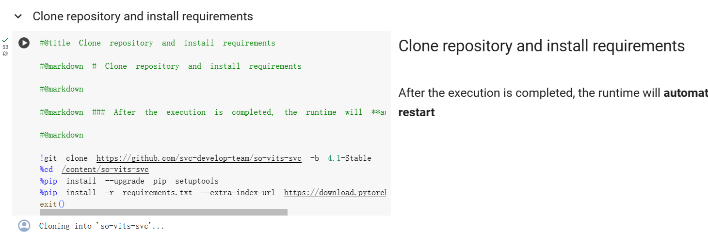

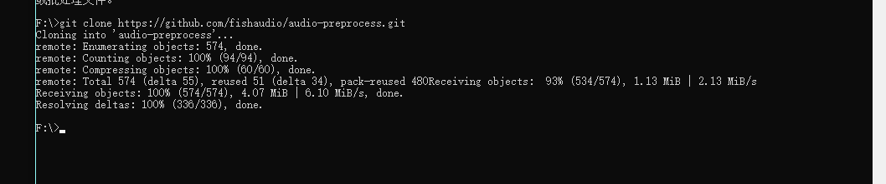-


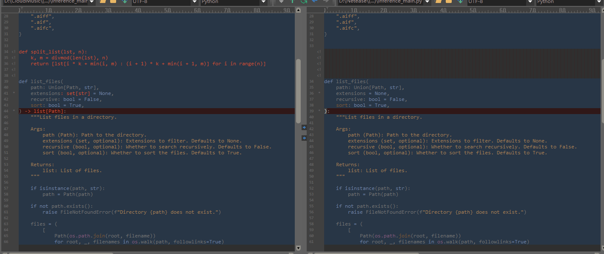

如果您将函数`list_files`的类型注解从`-> list[Path]`修改为没有指定具体类型，即去掉具体类型的注解，那么就不会再触发类型错误。这是因为Python的类型提示是可选的，您可以选择添加或删除它们，对于静态类型检查器而言，如果没有提供类型注解，它将无法对类型进行验证，因此不会再引发类型错误。

因此，如果您考虑删除特定的类型提示是为了避免类型错误，这是一个可行的方法。 但要注意，类型提示的存在可以帮助他人更容易地理解代码，并且在编写大型项目时，类型提示也有助于提高代码的可维护性和可读性。


```python
from pathlib import Path
from typing import Optional

from loguru import logger
from tqdm import tqdm

from fap.utils.file import AUDIO_EXTENSIONS, list_files


def length(
    input_dir: str,
    recursive: bool = False,
    visualize: bool = False,
    long_threshold: Optional[float] = None,
    short_threshold: Optional[float] = None,
):
    """
    Get the length of all audio files in a directory
    """

    import soundfile as sf
    from matplotlib import pyplot as plt

    input_dir = Path(input_dir)
    files = list_files(input_dir, AUDIO_EXTENSIONS, recursive=recursive)
    logger.info(f"Found {len(files)} files, calculating length")

    infos = []
    for file in tqdm(files, desc="Collecting infos"):
        sound = sf.SoundFile(str(file))
        infos.append(
            (
                len(sound),
                sound.samplerate,
                len(sound) / sound.samplerate,
                file.relative_to(input_dir),
            )
        )

    # Duration
    total_duration = sum(i[2] for i in infos)
    avg_duration = total_duration / len(infos)
    min_duration = min(i[2] for i in infos)
    max_duration = max(i[2] for i in infos)
    logger.info(f"Total duration: {total_duration / 3600:.2f} hours")
    logger.info(f"Average duration: {avg_duration:.2f} seconds")
    logger.info(f"Max duration: {max(i[2] for i in infos):.2f} seconds")
    logger.info(f"Min duration: {min(i[2] for i in infos):.2f} seconds")

    # Too Long
    if long_threshold is not None:
        long_files = [i for i in infos if i[2] > float(long_threshold)]

        # sort by duration
        if long_files:
            long_files = sorted(long_files, key=lambda x: x[2], reverse=True)
            logger.warning(
                f"Found {len(long_files)} files longer than {long_threshold} seconds"
            )
            for i in [f"{i[3]}: {i[2]:.2f}" for i in long_files]:
                logger.warning(f"    {i}")

    # Too Short
    if short_threshold is not None:
        short_files = [i for i in infos if i[2] < float(short_threshold)]

        if short_files:
            short_files = sorted(short_files, key=lambda x: x[2], reverse=False)
            logger.warning(
                f"Found {len(short_files)} files shorter than {short_threshold} seconds"
            )
            for i in [f"{i[3]}: {i[2]:.2f}" for i in short_files]:
                logger.warning(f"    {i}")

    # Sample Rate
    total_samplerate = sum(i[1] for i in infos)
    avg_samplerate = total_samplerate / len(infos)
    logger.info(f"Average samplerate: {avg_samplerate:.2f}")

    if not visualize:
        if short_threshold is not None:
            return len(files), total_duration, avg_duration, min_duration, max_duration, short_files
        else:
            return len(files), total_duration, avg_duration, min_duration, max_duration, None
        
    # Visualize
    plt.hist([i[2] for i in infos], bins=100)
    plt.title(
        f"Distribution of audio lengths (Total: {len(infos)} files, {total_duration / 3600:.2f} hours)"
    )
    plt.xlabel("Length (seconds)")
    plt.ylabel("Count")
    plt.show()


if __name__ == "__main__":
    length()

```

在第二个版本的代码中，对函数`length`进行了一些修改。参数列表中的`recursive`、`visualize`、`long_threshold`和`short_threshold`现在是可选的，并且都有了默认值。此外，在返回结果的部分也进行了修改。如果`visualize`为`False`，函数会根据`short_threshold`是否为`None`返回不同的结果。在处理过长或过短音频文件时，输出信息的显示也稍微不同，指明了具体发现的长音频文件数或短音频文件数。


需要删除并且修改一下文本内的内容

```python
# This file is edited from https://github.com/openvpi/audio-slicer/blob/main/slicer2.py

from pathlib import Path
from typing import Iterable, Union

import librosa
import numpy as np
import soundfile as sf

from fish_audio_preprocess.utils.slice_audio import slice_by_max_duration


def merge_short_chunks(chunks, max_duration, rate):
    merged_chunks = []
    buffer, length = [], 0

    for chunk in chunks:
        if length + len(chunk) > max_duration * rate and len(buffer) > 0:
            merged_chunks.append(np.concatenate(buffer))
            buffer, length = [], 0
        else:
            buffer.append(chunk)
            length += len(chunk)

    if len(buffer) > 0:
        merged_chunks.append(np.concatenate(buffer))

    return merged_chunks


class Slicer:
    def __init__(
        self,
        sr: int,
        threshold: float = -40.0,
        min_length: int = 5000,
        min_interval: int = 300,
        hop_size: int = 10,
        max_sil_kept: int = 5000,
    ):
        if not min_length >= min_interval >= hop_size:
            raise ValueError(
                "The following condition must be satisfied: min_length >= min_interval >= hop_size"
            )

        if not max_sil_kept >= hop_size:
            raise ValueError(
                "The following condition must be satisfied: max_sil_kept >= hop_size"
            )

        min_interval = sr * min_interval / 1000
        self.threshold = 10 ** (threshold / 20.0)
        self.hop_size = round(sr * hop_size / 1000)
        self.win_size = min(round(min_interval), 4 * self.hop_size)
        self.min_length = round(sr * min_length / 1000 / self.hop_size)
        self.min_interval = round(min_interval / self.hop_size)
        self.max_sil_kept = round(sr * max_sil_kept / 1000 / self.hop_size)

    def _apply_slice(self, waveform, begin, end):
        if len(waveform.shape) > 1:
            return waveform[
                :, begin * self.hop_size : min(waveform.shape[1], end * self.hop_size)
            ]
        else:
            return waveform[
                begin * self.hop_size : min(waveform.shape[0], end * self.hop_size)
            ]

    def slice(self, waveform):
        if len(waveform.shape) > 1:
            samples = waveform.mean(axis=0)
        else:
            samples = waveform

        if samples.shape[0] <= self.min_length:
            return [waveform]

        rms_list = librosa.feature.rms(
            y=samples, frame_length=self.win_size, hop_length=self.hop_size
        ).squeeze(0)
        sil_tags = []
        silence_start = None
        clip_start = 0

        for i, rms in enumerate(rms_list):
            # Keep looping while frame is silent.
            if rms < self.threshold:
                # Record start of silent frames.
                if silence_start is None:
                    silence_start = i
                continue

            # Keep looping while frame is not silent and silence start has not been recorded.
            if silence_start is None:
                continue

            # Clear recorded silence start if interval is not enough or clip is too short
            is_leading_silence = silence_start == 0 and i > self.max_sil_kept
            need_slice_middle = (
                i - silence_start >= self.min_interval
                and i - clip_start >= self.min_length
            )

            if not is_leading_silence and not need_slice_middle:
                silence_start = None
                continue

            # Need slicing. Record the range of silent frames to be removed.
            if i - silence_start <= self.max_sil_kept:
                pos = rms_list[silence_start : i + 1].argmin() + silence_start

                if silence_start == 0:
                    sil_tags.append((0, pos))
                else:
                    sil_tags.append((pos, pos))

                clip_start = pos
            elif i - silence_start <= self.max_sil_kept * 2:
                pos = rms_list[
                    i - self.max_sil_kept : silence_start + self.max_sil_kept + 1
                ].argmin()
                pos += i - self.max_sil_kept
                pos_l = (
                    rms_list[
                        silence_start : silence_start + self.max_sil_kept + 1
                    ].argmin()
                    + silence_start
                )
                pos_r = (
                    rms_list[i - self.max_sil_kept : i + 1].argmin()
                    + i
                    - self.max_sil_kept
                )

                if silence_start == 0:
                    sil_tags.append((0, pos_r))
                    clip_start = pos_r
                else:
                    sil_tags.append((min(pos_l, pos), max(pos_r, pos)))
                    clip_start = max(pos_r, pos)
            else:
                pos_l = (
                    rms_list[
                        silence_start : silence_start + self.max_sil_kept + 1
                    ].argmin()
                    + silence_start
                )
                pos_r = (
                    rms_list[i - self.max_sil_kept : i + 1].argmin()
                    + i
                    - self.max_sil_kept
                )

                if silence_start == 0:
                    sil_tags.append((0, pos_r))
                else:
                    sil_tags.append((pos_l, pos_r))

                clip_start = pos_r
            silence_start = None

        # Deal with trailing silence.
        total_frames = rms_list.shape[0]
        if (
            silence_start is not None
            and total_frames - silence_start >= self.min_interval
        ):
            silence_end = min(total_frames, silence_start + self.max_sil_kept)
            pos = rms_list[silence_start : silence_end + 1].argmin() + silence_start
            sil_tags.append((pos, total_frames + 1))

        # Apply and return slices.
        if len(sil_tags) == 0:
            return [waveform]
        else:
            chunks = []

            if sil_tags[0][0] > 0:
                chunks.append(self._apply_slice(waveform, 0, sil_tags[0][0]))

            for i in range(len(sil_tags) - 1):
                chunks.append(
                    self._apply_slice(waveform, sil_tags[i][1], sil_tags[i + 1][0])
                )

            if sil_tags[-1][1] < total_frames:
                chunks.append(
                    self._apply_slice(waveform, sil_tags[-1][1], total_frames)
                )

            return chunks


def slice_audio_v2(
    audio: np.ndarray,
    rate: int,
    min_duration: float = 5.0,
    max_duration: float = 30.0,
    min_silence_duration: float = 0.3,
    top_db: int = -40,
    hop_length: int = 10,
    max_silence_kept: float = 0.5,
    merge_short: bool = False,
) -> Iterable[np.ndarray]:
    """Slice audio by silence

    Args:
        audio: audio data, in shape (samples, channels)
        rate: sample rate
        min_duration: minimum duration of each slice
        max_duration: maximum duration of each slice
        min_silence_duration: minimum duration of silence
        top_db: threshold to detect silence
        hop_length: hop length to detect silence
        max_silence_kept: maximum duration of silence to be kept
        merge_short: merge short slices automatically

    Returns:
        Iterable of sliced audio
    """

    if len(audio) / rate < min_duration:
        sliced_by_max_duration_chunk = slice_by_max_duration(audio, max_duration, rate)
        yield from merge_short_chunks(
            sliced_by_max_duration_chunk, max_duration, rate
        ) if merge_short else sliced_by_max_duration_chunk
        return

    slicer = Slicer(
        sr=rate,
        threshold=top_db,
        min_length=min_duration * 1000,
        min_interval=min_silence_duration * 1000,
        hop_size=hop_length,
        max_sil_kept=max_silence_kept * 1000,
    )

    sliced_audio = slicer.slice(audio)
    if merge_short:
        sliced_audio = merge_short_chunks(sliced_audio, max_duration, rate)

    for chunk in sliced_audio:
        sliced_by_max_duration_chunk = slice_by_max_duration(chunk, max_duration, rate)
        yield from sliced_by_max_duration_chunk


def slice_audio_file_v2(
    input_file: Union[str, Path],
    output_dir: Union[str, Path],
    min_duration: float = 5.0,
    max_duration: float = 30.0,
    min_silence_duration: float = 0.3,
    top_db: int = -40,
    hop_length: int = 10,
    max_silence_kept: float = 0.5,
    flat_layout: bool = False,
    merge_short: bool = False,
) -> None:
    """
    Slice audio by silence and save to output folder

    Args:
        input_file: input audio file
        output_dir: output folder
        min_duration: minimum duration of each slice
        max_duration: maximum duration of each slice
        min_silence_duration: minimum duration of silence
        top_db: threshold to detect silence
        hop_length: hop length to detect silence
        max_silence_kept: maximum duration of silence to be kept
        flat_layout: use flat directory structure
        merge_short: merge short slices automatically
    """

    output_dir = Path(output_dir)

    audio, rate = librosa.load(str(input_file), sr=None, mono=True)
    for idx, sliced in enumerate(
        slice_audio_v2(
            audio,
            rate,
            min_duration=min_duration,
            max_duration=max_duration,
            min_silence_duration=min_silence_duration,
            top_db=top_db,
            hop_length=hop_length,
            max_silence_kept=max_silence_kept,
            merge_short=merge_short,
        )
    ):
        if flat_layout:
            sf.write(str(output_dir) + f"_{idx:04d}.wav", sliced, rate)
        else:
            sf.write(str(output_dir / f"{idx:04d}.wav"), sliced, rate)

```

修改后代码如下

```python
# This file is edited from https://github.com/openvpi/audio-slicer/blob/main/slicer2.py

from pathlib import Path
from typing import Iterable, Union

import librosa
import numpy as np
import soundfile as sf

from fish_audio_preprocess.utils.slice_audio import slice_by_max_duration


class Slicer:
    def __init__(
        self,
        sr: int,
        threshold: float = -40.0,
        min_length: int = 5000,
        min_interval: int = 300,
        hop_size: int = 10,
        max_sil_kept: int = 5000,
    ):
        if not min_length >= min_interval >= hop_size:
            raise ValueError(
                "The following condition must be satisfied: min_length >= min_interval >= hop_size"
            )

        if not max_sil_kept >= hop_size:
            raise ValueError(
                "The following condition must be satisfied: max_sil_kept >= hop_size"
            )

        min_interval = sr * min_interval / 1000
        self.threshold = 10 ** (threshold / 20.0)
        self.hop_size = round(sr * hop_size / 1000)
        self.win_size = min(round(min_interval), 4 * self.hop_size)
        self.min_length = round(sr * min_length / 1000 / self.hop_size)
        self.min_interval = round(min_interval / self.hop_size)
        self.max_sil_kept = round(sr * max_sil_kept / 1000 / self.hop_size)

    def _apply_slice(self, waveform, begin, end):
        if len(waveform.shape) > 1:
            return waveform[
                :, begin * self.hop_size : min(waveform.shape[1], end * self.hop_size)
            ]
        else:
            return waveform[
                begin * self.hop_size : min(waveform.shape[0], end * self.hop_size)
            ]

    def slice(self, waveform):
        if len(waveform.shape) > 1:
            samples = waveform.mean(axis=0)
        else:
            samples = waveform

        if samples.shape[0] <= self.min_length:
            return [waveform]

        rms_list = librosa.feature.rms(
            y=samples, frame_length=self.win_size, hop_length=self.hop_size
        ).squeeze(0)
        sil_tags = []
        silence_start = None
        clip_start = 0

        for i, rms in enumerate(rms_list):
            # Keep looping while frame is silent.
            if rms < self.threshold:
                # Record start of silent frames.
                if silence_start is None:
                    silence_start = i
                continue

            # Keep looping while frame is not silent and silence start has not been recorded.
            if silence_start is None:
                continue

            # Clear recorded silence start if interval is not enough or clip is too short
            is_leading_silence = silence_start == 0 and i > self.max_sil_kept
            need_slice_middle = (
                i - silence_start >= self.min_interval
                and i - clip_start >= self.min_length
            )

            if not is_leading_silence and not need_slice_middle:
                silence_start = None
                continue

            # Need slicing. Record the range of silent frames to be removed.
            if i - silence_start <= self.max_sil_kept:
                pos = rms_list[silence_start : i + 1].argmin() + silence_start

                if silence_start == 0:
                    sil_tags.append((0, pos))
                else:
                    sil_tags.append((pos, pos))

                clip_start = pos
            elif i - silence_start <= self.max_sil_kept * 2:
                pos = rms_list[
                    i - self.max_sil_kept : silence_start + self.max_sil_kept + 1
                ].argmin()
                pos += i - self.max_sil_kept
                pos_l = (
                    rms_list[
                        silence_start : silence_start + self.max_sil_kept + 1
                    ].argmin()
                    + silence_start
                )
                pos_r = (
                    rms_list[i - self.max_sil_kept : i + 1].argmin()
                    + i
                    - self.max_sil_kept
                )

                if silence_start == 0:
                    sil_tags.append((0, pos_r))
                    clip_start = pos_r
                else:
                    sil_tags.append((min(pos_l, pos), max(pos_r, pos)))
                    clip_start = max(pos_r, pos)
            else:
                pos_l = (
                    rms_list[
                        silence_start : silence_start + self.max_sil_kept + 1
                    ].argmin()
                    + silence_start
                )
                pos_r = (
                    rms_list[i - self.max_sil_kept : i + 1].argmin()
                    + i
                    - self.max_sil_kept
                )

                if silence_start == 0:
                    sil_tags.append((0, pos_r))
                else:
                    sil_tags.append((pos_l, pos_r))

                clip_start = pos_r
            silence_start = None

        # Deal with trailing silence.
        total_frames = rms_list.shape[0]
        if (
            silence_start is not None
            and total_frames - silence_start >= self.min_interval
        ):
            silence_end = min(total_frames, silence_start + self.max_sil_kept)
            pos = rms_list[silence_start : silence_end + 1].argmin() + silence_start
            sil_tags.append((pos, total_frames + 1))

        # Apply and return slices.
        if len(sil_tags) == 0:
            return [waveform]
        else:
            chunks = []

            if sil_tags[0][0] > 0:
                chunks.append(self._apply_slice(waveform, 0, sil_tags[0][0]))

            for i in range(len(sil_tags) - 1):
                chunks.append(
                    self._apply_slice(waveform, sil_tags[i][1], sil_tags[i + 1][0])
                )

            if sil_tags[-1][1] < total_frames:
                chunks.append(
                    self._apply_slice(waveform, sil_tags[-1][1], total_frames)
                )

            return chunks


def slice_audio_v2(
    audio: np.ndarray,
    rate: int,
    min_duration: float = 5.0,
    max_duration: float = 30.0,
    min_silence_duration: float = 0.3,
    top_db: int = -40,
    hop_length: int = 10,
    max_silence_kept: float = 0.5,
) -> Iterable[np.ndarray]:
    """Slice audio by silence

    Args:
        audio: audio data, in shape (samples, channels)
        rate: sample rate
        min_duration: minimum duration of each slice
        max_duration: maximum duration of each slice
        min_silence_duration: minimum duration of silence
        top_db: threshold to detect silence
        hop_length: hop length to detect silence
        max_silence_kept: maximum duration of silence to be kept

    Returns:
        Iterable of sliced audio
    """

    if len(audio) / rate < min_duration:
        yield from slice_by_max_duration(audio, max_duration, rate)
        return

    slicer = Slicer(
        sr=rate,
        threshold=top_db,
        min_length=min_duration * 1000,
        min_interval=min_silence_duration * 1000,
        hop_size=hop_length,
        max_sil_kept=max_silence_kept * 1000,
    )

    for chunk in slicer.slice(audio):
        yield from slice_by_max_duration(chunk, max_duration, rate)


def slice_audio_file_v2(
    input_file: Union[str, Path],
    output_dir: Union[str, Path],
    min_duration: float = 5.0,
    max_duration: float = 30.0,
    min_silence_duration: float = 0.3,
    top_db: int = -40,
    hop_length: int = 10,
    max_silence_kept: float = 0.5,
) -> None:
    """
    Slice audio by silence and save to output folder

    Args:
        input_file: input audio file
        output_dir: output folder
        min_duration: minimum duration of each slice
        max_duration: maximum duration of each slice
        min_silence_duration: minimum duration of silence
        top_db: threshold to detect silence
        hop_length: hop length to detect silence
        max_silence_kept: maximum duration of silence to be kept
    """

    output_dir = Path(output_dir)
    output_dir.mkdir(parents=True, exist_ok=True)

    input_file_name = Path(input_file).stem
    audio, rate = librosa.load(str(input_file), sr=None, mono=True)
    for idx, sliced in enumerate(
        slice_audio_v2(
            audio,
            rate,
            min_duration=min_duration,
            max_duration=max_duration,
            min_silence_duration=min_silence_duration,
            top_db=top_db,
            hop_length=hop_length,
            max_silence_kept=max_silence_kept,
        )
    ):
        sf.write(str(output_dir / f"{input_file_name}_{idx:04d}.wav"), sliced, rate)

```


1. 

2. *移除了merge_short参数**：原始代码中的`merge_short`参数用于控制是否自动合并短音频片段，我在修改后的代码中将其移除，以简化逻辑。

3. **修改了判定条件**：我将原始代码中对于音频长度小于`min_duration`时的处理逻辑进行了修改。原先在这种情况下会执行合并短片段的操作，而我修改后则直接通过`slice_audio_v2`函数来裁剪音频，而不再合并或限制数量。

4. **删除了返回值**：由于现在裁剪条目的数量不再有限制，所以在函数的最后不再需要返回`None`，因为函数会一直运行直到音频全部被处理完毕。

   二次修改

   ```python
   file_name_changes = 0
   current_input_file_name = None
   #用于进行中文消除
   def slice_audio_file_v2(
       input_file: Union[str, Path],
       output_dir: Union[str, Path],
       min_duration: float = 5.0,
       max_duration: float = 30.0,
       min_silence_duration: float = 0.3,
       top_db: int = -40,
       hop_length: int = 10,
       max_silence_kept: float = 0.5,
   ) -> None:
       global file_name_changes
       global current_input_file_name
   
       output_dir = Path(output_dir)
       output_dir.mkdir(parents=True, exist_ok=True)
   
       input_file_name = Path(input_file).stem
   
       if input_file_name != current_input_file_name:
           file_name_changes += 1
           current_input_file_name = input_file_name
   
       audio, rate = librosa.load(str(input_file), sr=None, mono=True)
       for idx, sliced in enumerate(
           slice_audio_v2(
               audio,
               rate,
               min_duration=min_duration,
               max_duration=max_duration,
               min_silence_duration=min_silence_duration,
               top_db=top_db,
               hop_length=hop_length,
               max_silence_kept=max_silence_kept,
           )
       ):
           sf.write(str(output_dir / f"{file_name_changes:04d}_{idx:04d}.wav"), sliced, rate)#输出为对应人声干音的序号_切片在该干音的序号。
   
   ```

   定义了一个全局变量，作用是对切片里的中文名进行处理，因为模型不允许中文输入。

   ```python
   import os
   import PyInstaller.__main__
   import tkinter as tk
   from tkinter import filedialog
   import subprocess
   
   def select_bat_file():
       root = tk.Tk()
       root.withdraw()
       file_path = filedialog.askopenfilename(filetypes=[("BAT文件", "*.bat")])
       return file_path
   
   def create_python_script(bat_file):
       with open('temp_script.py', 'w', encoding='utf-8') as f:
           f.write('import subprocess\n')
           f.write('import tkinter as tk\n\n')
           
           f.write('# 创建一个关闭cmd进程的函数\n')
           f.write('def close_process():\n')
           f.write('    subprocess.call("taskkill /f /im cmd.exe", shell=True)\n')
           f.write('    exit()\n\n')
           
           f.write('# 创建GUI窗口\n')
           f.write('root = tk.Tk()\n')
           f.write('root.title("关闭CMD进程")\n\n')
           
           f.write('# 创建关闭按钮\n')
           f.write('button = tk.Button(root, text="关闭CMD进程", command=close_process)\n')
           f.write('button.pack()\n\n')
           
           f.write('# 使用subprocess调用BAT文件\n')
           f.write(f'subprocess.call(["cmd", "/c", "{bat_file}"], shell=True)\n')
   
           f.write('root.mainloop()\n')
   
   def convert_bat_to_exe(bat_file, output_exe_name):
       create_python_script(bat_file)
       output_dir = os.path.dirname(bat_file)
       PyInstaller.__main__.run([
           '--onefile',
           # '--noconsole',  # 移除 --noconsole 参数
           '--distpath=' + output_dir,
           f'--name={output_exe_name}',
           'temp_script.py'
       ])
       os.remove('temp_script.py')
       print("BAT文件成功转换为EXE文件！")
   
   if __name__ == "__main__":
       bat_file_path = select_bat_file()
       
       if bat_file_path.endswith(".bat"):
           output_exe_name = input("请输入输出EXE文件的名称：")
           convert_bat_to_exe(bat_file_path, output_exe_name)
       else:
           print("请勾选有效的BAT文件。")
   
   ```

   bat转exe方法

   待转bat如下

   ```powershell
   @echo off
   chcp 65001
   echo ================================ 稍等片刻，系统正在加载 ================================
   echo =======================================================================================
   echo ================================ ***请勿关闭本窗口*** ================================
   echo =======================================================================================
   echo ================================ ***正在启动，即将自动跳转*** ================================
   .\env\python.exe index.py
   
   pause
   ```

修改实现图形化窗口控制

```python
import os
import PyInstaller.__main__
import tkinter as tk
from tkinter import filedialog
import subprocess
import threading  # 导入 threading 模块

def select_bat_file():
    root = tk.Tk()
    root.withdraw()
    file_path = filedialog.askopenfilename(filetypes=[("BAT文件", "*.bat")])
    return file_path

def create_python_script(bat_file):
    with open('temp_script.py', 'w', encoding='utf-8') as f:
        f.write('import subprocess\n')
        f.write('import tkinter as tk\n')
        f.write('import threading\n\n')  # 导入 threading 模块
        
        f.write('def close_process():\n')
        f.write('    subprocess.call(["taskkill", "/F", "/T", "/IM", "cmd.exe"], shell=True)\n')
        f.write('    exit()\n\n')

        f.write('def run_bat(bat_file):\n')
        f.write('    script = """start /B cmd /c {}\nexit"""\n'.format(bat_file))  # 创建一个批处理脚本
        f.write('    subprocess.Popen(script, shell=True)\n\n')
        
        f.write('def create_window():\n')
        f.write('    root = tk.Tk()\n')
        f.write('    root.title("关闭CMD进程")\n\n')
        
        f.write('    button = tk.Button(root, text="关闭CMD进程", command=close_process)\n')
        f.write('    button.pack()\n\n')
        
        f.write('    root.mainloop()\n')

        f.write('bat_file = r"{}"\n'.format(bat_file.replace('\\', '\\\\')))
        f.write('threading.Thread(target=run_bat, args=(bat_file,)).start()\n')
        f.write('create_window()')

def convert_bat_to_exe(bat_file, output_exe_name):
    create_python_script(bat_file)
    output_dir = os.path.dirname(bat_file)
    PyInstaller.__main__.run([
        '--onefile',
        '--noconsole',  # 移除 --noconsole 参数
        '--distpath=' + output_dir,
        f'--name={output_exe_name}',
        'temp_script.py'
    ])
    os.remove('temp_script.py')
    print("BAT文件成功转换为EXE文件！")

if __name__ == "__main__":
    bat_file_path = select_bat_file()
    
    if bat_file_path.endswith(".bat"):
        output_exe_name = input("请输入输出EXE文件的名称：")
        convert_bat_to_exe(bat_file_path, output_exe_name)
    else:
        print("请勾选有效的BAT文件。")

```

修改实现输出与重启

```python
import os
import PyInstaller.__main__
import tkinter as tk
from tkinter import filedialog
import subprocess
import threading

def select_bat_file():
    # 创建选择BAT文件的窗口
    root = tk.Tk()
    root.withdraw()
    # 弹出文件对话框并返回选择的BAT文件路径
    file_path = filedialog.askopenfilename(filetypes=[("BAT文件", "*.bat")])
    return file_path

def create_python_script(bat_file):
    with open('temp_script.py', 'w', encoding='utf-8') as f:
        # 写入Python脚本内容
        f.write('import subprocess\n')
        f.write('import tkinter as tk\n')
        f.write('import threading\n\n')
        
        # 关闭进程的函数
        f.write('def close_process():\n')
        f.write('    # 调用系统命令杀死cmd进程\n')
        f.write('    subprocess.call(["taskkill", "/F", "/T", "/IM", "cmd.exe"], shell=True)\n')
        f.write('    # 修改状态标签显示文本\n')
        f.write('    status_label.config(text="成功关闭 CMD 进程")\n')
        f.write('    # 10秒后清空状态标签\n')
        f.write('    root.after(10000, clear_status)\n\n')

        # 重启cmd进程的函数
        f.write('def restart_cmd(bat_file):\n')
        f.write('    # 修改状态标签显示文本\n')
        f.write('    status_label.config(text="正在重启 CMD 进程...")\n')
        f.write('    # 执行BAT文件\n')
        f.write('    run_bat(bat_file)\n')

        # 执行BAT文件的函数
        f.write('def run_bat(bat_file):\n')
        f.write('    # 构建启动BAT文件的命令\n')
        f.write('    script = """start /B cmd /c {}\nexit"""\n'.format(bat_file))
        f.write('    # 使用subprocess启动新进程\n')
        f.write('    subprocess.Popen(script, shell=True)\n\n')
        
        # 创建窗口的函数
        f.write('def create_window():\n')
        f.write('    global root\n')
        f.write('    global status_label\n')
        
        f.write('    # 创建主窗口\n')
        f.write('    root = tk.Tk()\n')
        f.write('    root.title("关闭和重启 CMD 进程")\n\n')
        
        # 创建状态标签并放置在窗口中
        f.write('    status_label = tk.Label(root, text="", pady=10)\n')
        f.write('    status_label.pack()\n\n')

        # 创建关闭按钮
        f.write('    button_close = tk.Button(root, text="关闭 CMD 进程", command=close_process)\n')
        f.write('    button_close.pack()\n\n')

        # 创建重启标签并放置在窗口中
        f.write('    restart_label = tk.Label(root, text="重新启动 CMD 进程")\n')
        f.write('    restart_label.pack()\n\n')
        
        # 创建重启按钮
        f.write('    button_restart = tk.Button(root, text="重启 CMD", command=lambda: restart_cmd(bat_file))\n')
        f.write('    button_restart.pack()\n\n')

        # 运行窗口程序
        f.write('    root.mainloop()\n')

        # 设置BAT文件路径并启动线程执行BAT文件
        f.write('bat_file = r"{}"\n'.format(bat_file.replace('\\', '\\\\')))
        f.write('threading.Thread(target=run_bat, args=(bat_file,)).start()\n')
        f.write('create_window()')

def clear_status():
    # 清空状态标签的文本
    status_label.config(text="")

def convert_bat_to_exe(bat_file, output_exe_name):
    # 创建Python脚本
    create_python_script(bat_file)
    # 获取输出目录
    output_dir = os.path.dirname(bat_file)
    # 使用PyInstaller转换为EXE文件
    PyInstaller.__main__.run([
        '--onefile',
        '--noconsole',
        '--distpath=' + output_dir,
        f'--name={output_exe_name}',
        'temp_script.py'
    ])
    # 删除临时Python脚本文件
    os.remove('temp_script.py')
    print("BAT文件成功转换为EXE文件！")

if __name__ == "__main__":
    # 选择BAT文件
    bat_file_path = select_bat_file()
    
    if bat_file_path.endswith(".bat"):
        # 输入输出EXE文件的名称
        output_exe_name = input("请输入输出EXE文件的名称：")
        # 转换BAT文件为EXE文件
        convert_bat_to_exe(bat_file_path, output_exe_name)
    else:
        print("请勾选有效的BAT文件。")

```

